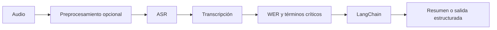

# L2: Audio y pipelines

## Orden sugerido

1. `openai_whisper`: transcripción remota y evaluación WER.
2. `huggingface/00_datos_tokenizers`: datasets, BPE y WordPiece.
3. `huggingface/01_audio`: transcripción local y WER.
4. `huggingface/02_diffusion`: diferencia entre Transformers y difusión.
5. `langchain`: postproceso de transcripciones con prompts y cadenas.
6. Ejecutá los dos pipelines `en_marcha` para comparar API y ejecución local.

El resultado esperado es el recorrido `audio -> transcripción -> evaluación` y una
primera comprensión de cómo el texto se convierte en tokens.

Después recorré `resumen/` de menor a mayor. Cada archivo agrega una decisión
concreta sin ocultar los pasos anteriores:

1. `00` a `02`: WER, salida Pydantic y gate de revisión sobre texto pequeño.
2. `03` a `05`: el mismo razonamiento como flujo LangGraph y routing visible.
3. `06` y `07`: tres audios reales, Whisper y clasificación por tipo de audio.
4. `08`: auditor que separa WER global de errores críticos de dominio.
5. `09`: pipeline de reunión que termina en resumen, decisiones y tareas.
6. `10`: benchmark de robustez con audio limpio, ruidoso y degradado.
7. `11`: pipeline LangGraph auditable: ASR, WER y destino operativo.

La progresión didáctica es: `audio -> ASR -> texto -> WER -> Pydantic -> agente
LangChain -> routing LangGraph -> benchmark y operación`. Así el alumno primero
ve un dato aislado, luego comprende su calidad y al final observa un pipeline
real que sabe cuándo detener la automatización.

## Guías por tecnología y tema

Además de `resumen/`, cada recorrido de `extras/L2` tiene Markdown en sus
subcarpetas temáticas. Cada guía documenta sus archivos Python con teoría,
gráficos Mermaid, tablas, fórmulas, código explicado y ejercicios:

- `openai_whisper`: transcripción remota, WER y pipeline completo.
- `huggingface`: Dataset, BPE, WordPiece, ASR local, JiWER y difusión.
- `langchain`: postproceso de transcripciones y responsabilidades del pipeline.
# L2 — Audio y pipelines

Esta carpeta se recorre de señal a decisión: primero se obtiene texto desde audio, luego se mide su calidad y finalmente se usa un LLM solamente sobre el texto que ya fue revisado.

| Tecnología | Propósito | Material de apoyo |
|---|---|---|
| [OpenAI Whisper](openai_whisper/README.md) | ASR por API, WER e integrador | Guía junto a cada `.py`. |
| [Hugging Face](huggingface/README.md) | Dataset, tokens, ASR local y difusión | Guía junto a cada `.py`. |
| [LangChain](langchain/README.md) | Posprocesar el texto transcripto | Guía junto al `.py`. |
| [Resumen](resumen/README.md) | Casos integradores de la lecture | Repaso y agentes. |

## Regla de calidad

Una respuesta bien redactada no corrige una transcripción defectuosa. Antes de resumir, clasificar o tomar una decisión se valida WER y, en dominios sensibles, se revisan números, nombres y términos críticos.
