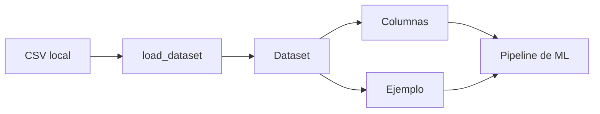
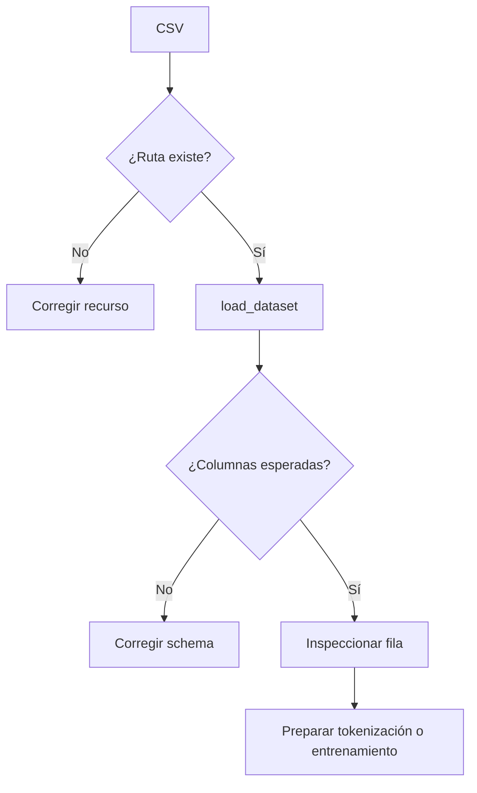

# 00 — Cargar un dataset local con Hugging Face

## Objetivo

`00_dataset_local.py` abre un CSV local con `datasets`, inspecciona una fila y muestra las columnas. Antes de entrenar o evaluar, el dato debe tener un formato explícito y verificable.



## Lectura del código

```python
# Declara que el origen es CSV y selecciona la partición de entrenamiento.
dataset = load_dataset("csv", data_files=str(ruta_csv), split="train")

# Muestra un registro concreto antes de confiar en los datos.
print(dataset[0])
```

| Elemento | Función | Pregunta para clase |
|---|---|---|
| `Path` | Construye rutas portables | ¿El CSV existe en otra computadora? |
| `data_files` | Indica el archivo de entrada | ¿Qué formato recibe el modelo? |
| `split="train"` | Nombra el conjunto | ¿Está separado de validación y test? |
| `dataset[0]` | Inspecciona una fila | ¿Las columnas tienen el significado esperado? |

## Teoría

Un dataset es un contrato entre datos y modelo. Para audio suele contener una ruta al archivo, una transcripción y, si corresponde, una etiqueta. Validar una muestra temprana evita entrenar sobre rutas rotas, transcripciones vacías o columnas mal nombradas.

| Buen control | Razón |
|---|---|
| Rutas relativas estables | El ejercicio funciona al mover la carpeta. |
| Texto de referencia | Permite calcular WER. |
| División train/validation/test | Evita medir con ejemplos ya vistos. |

## Práctica

Agregá una fila al CSV, ejecutá otra vez y verificá el largo del dataset. Luego cambiá una columna para observar por qué los nombres forman parte del contrato.

---

## Recorrido del código, paso a paso

### 1. Localizar el recurso del ejercicio

```python
ruta_csv = Path(__file__).resolve().parents[1] / "data/intenciones.csv"
```

El script se ubica dentro de `00_datos_tokenizers`; al subir una carpeta encuentra el área de Hugging Face y desde allí entra en `data/`. Usar `Path` evita depender de la carpeta actual de la terminal y vuelve el ejemplo reproducible para cada alumno.

### 2. Convertir una tabla en un objeto `Dataset`

```python
dataset = load_dataset("csv", data_files=str(ruta_csv), split="train")
```

El primer argumento selecciona el lector de CSV. `data_files` recibe la ruta ya transformada en texto. `split="train"` pide directamente la partición llamada entrenamiento. Para este ejemplo pequeño existe un solo archivo; en un proyecto real se podrían declarar archivos diferentes para `train`, `validation` y `test`.

| Elemento del código | Entrada | Salida | Por qué se enseña |
|---|---|---|---|
| `Path(...)` | Ubicación del script | Ruta absoluta estable | Separar código de ubicación de ejecución. |
| `load_dataset("csv", ...)` | Filas de texto | `Dataset` | Agrega schema y operaciones de ML. |
| `split="train"` | Nombre de partición | Conjunto de entrenamiento | Prepara la conversación sobre evaluación honesta. |

### 3. Inspeccionar antes de entrenar

```python
print("Filas:", len(dataset))
print("Columnas:", dataset.column_names)
print("Primer caso:", dataset[0])
```

Estas tres líneas son controles de calidad mínimos. `len` detecta cargas vacías o incompletas; `column_names` hace visible el contrato de columnas; `dataset[0]` verifica tipos y contenido real, no solo metadatos.



## Conexión con audio

Un dataset de audio suele tener la ruta al WAV y una transcripción humana. La primera se usa como entrada; la segunda sirve tanto como etiqueta de entrenamiento como referencia para WER. Si se mezclan los audios de evaluación con los de entrenamiento, el resultado deja de medir generalización.

| Problema de datos | Señal visible | Consecuencia para el modelo | Control |
|---|---|---|---|
| Ruta rota | No carga el audio | Ejemplo inutilizable | Validar al preparar dataset. |
| Texto vacío | Fila sin etiqueta | Entrenamiento corrupto | Filtrar y registrar. |
| Split mezclado | Caso repetido | Métrica optimista | Separar antes de entrenar. |
| Etiqueta inconsistente | Dos formas del mismo dato | WER o entrenamiento engañoso | Normalizar con criterio documentado. |

## Preguntas para profundizar

1. ¿Por qué inspeccionar una sola fila no demuestra calidad total, pero sigue siendo útil?
2. ¿Qué columnas agregarías para auditar idioma, ruido y duración del audio?
3. ¿Qué diferencia hay entre guardar una tabla y definir un contrato de dataset?
