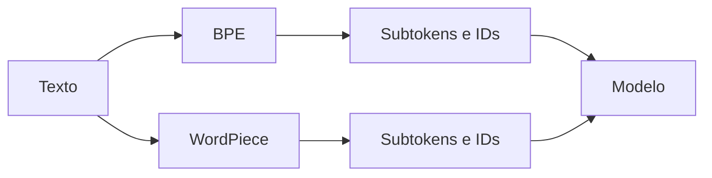
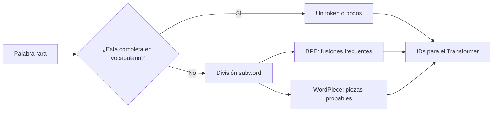

# 01 — BPE y WordPiece: dos tokenizadores subword

## Objetivo

`01_bpe_wordpiece.py` tokeniza la misma oración con GPT-2 (BPE) y BERT multilingüe (WordPiece). El modelo no recibe palabras enteras: recibe identificadores numéricos de fragmentos llamados tokens.



## Lectura del código

```python
# Recupera el vocabulario del tokenizador elegido.
tokenizador_bpe = AutoTokenizer.from_pretrained("gpt2")
tokenizador_wordpiece = AutoTokenizer.from_pretrained("bert-base-multilingual-cased")

# Convierte el mismo texto en unidades de cada arquitectura.
print(tokenizador_bpe.tokenize(texto))
print(tokenizador_wordpiece.tokenize(texto))
```

| Técnica | Idea | Ventaja | Límite |
|---|---|---|---|
| BPE | Fusiona pares frecuentes | Vocabulario eficiente | Depende del corpus usado. |
| WordPiece | Escoge fragmentos probables | Maneja palabras no vistas | Divide distinto a BPE. |
| Carácter | Un símbolo por unidad | Nunca queda sin representación | Secuencias largas. |
| Palabra | Una palabra por unidad | Fácil de explicar | Falla con palabras nuevas. |

## Teoría aplicada a ASR

En ASR, tokenizar bien importa porque los términos específicos pueden fragmentarse. No es un error: el Transformer aprende a combinar los subtokens según el contexto.

## Práctica

Probá con un apellido, una sigla y una palabra inventada. Compará cuántos tokens produce cada modelo y discutí el costo de procesar un texto largo.

---

## Recorrido del código, paso a paso

### 1. Cargar tokenizadores, no modelos generativos

```python
tokenizer_bpe = AutoTokenizer.from_pretrained("gpt2")
tokenizer_wordpiece = AutoTokenizer.from_pretrained(
    "bert-base-multilingual-cased"
)
```

`AutoTokenizer` descarga o recupera localmente reglas y vocabulario. No está cargando el Transformer completo: solo el componente que convierte texto en unidades numéricas. Cada nombre refiere a un vocabulario entrenado con decisiones históricas distintas.

### 2. Elegir un texto que haga visible el problema

```python
texto = "hiperpersonalización contractual"
```

La frase usa una palabra larga y de dominio. En vocabularios reales no es seguro que aparezca como una sola unidad; los métodos *subword* la dividen para seguir representándola aun si era rara o desconocida.

### 3. Observar tokens en lugar de asumir palabras

```python
tokens_bpe = tokenizer_bpe.tokenize(texto)
tokens_wordpiece = tokenizer_wordpiece.tokenize(texto)
```

`tokenize()` muestra las piezas legibles. Más adelante, el tokenizador también las transforma en IDs y puede aplicar padding, truncamiento y máscaras. Este script frena antes para que el alumno vea la partición y no una lista opaca de enteros.

| Paso | Entrada | Salida | Error de interpretación frecuente |
|---|---|---|---|
| `from_pretrained` | Nombre del repositorio | Reglas + vocabulario | Creer que carga el modelo completo. |
| `tokenize` | Una cadena | Lista de subtokens | Creer que cada token es una palabra. |
| `print` | Dos listas | Comparación visible | Concluir que uno es “mejor” solo por tener menos tokens. |



## BPE y WordPiece con más precisión

| Aspecto | BPE | WordPiece |
|---|---|---|
| Construcción de vocabulario | Fusiona iterativamente pares frecuentes. | Selecciona piezas que mejor explican datos. |
| Representación de continuación | Depende del tokenizer; GPT-2 puede marcar espacios. | Suele usar `##` en continuaciones. |
| Idea común | Reducir palabras abiertas a piezas reutilizables. | Reducir palabras abiertas a piezas reutilizables. |
| Consecuencia práctica | Longitud y fragmentación dependen del vocabulario. | Longitud y fragmentación dependen del vocabulario. |

## Conexión con ASR y LLM

La transcripción termina como una secuencia de tokens que un Transformer puede predecir o interpretar. Una división rara no implica que el modelo falló: el contexto entre subtokens permite reconstruir significados. Pero una mayor cantidad de tokens aumenta longitud de contexto, memoria y costo de inferencia.

## Experimento guiado

Probá sucesivamente `"Ricardo"`, una sigla técnica y una palabra inventada. Para cada una registrá tokens, cantidad y si resulta inteligible. La discusión no es “qué tokenizador gana”, sino qué vocabulario está mejor alineado a una tarea e idioma.
