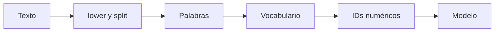

# 02 — Tokenización por palabra

## Objetivo del ejercicio

`02_por_palabra.py` muestra la forma más directa de tokenizar: separar una frase en palabras completas y asignar a cada una un ID. No usa un modelo pesado porque el propósito es hacer visible el mecanismo antes de pasar a los tokenizadores reales de Hugging Face.



## Recorrido paso a paso

### 1. Texto de entrada

```python
texto = "El paciente necesita una reprogramación clínica"
```

La frase representa una posible transcripción de audio. El tokenizador no entiende significado médico: solo transforma texto en unidades que un modelo pueda recibir.

### 2. Normalización y separación

```python
tokens = texto.lower().split()
```

`lower()` evita tener tokens diferentes para `El` y `el`. `split()` separa usando espacios. El resultado es una lista como `['el', 'paciente', 'necesita', ...]`.

### 3. Vocabulario e IDs

```python
vocabulario = {token: indice for indice, token in enumerate(sorted(set(tokens)), start=1)}
ids = [vocabulario[token] for token in tokens]
```

`set(tokens)` elimina repeticiones; `sorted` hace que el ejemplo sea reproducible; `enumerate(..., start=1)` asigna IDs. La segunda lista reemplaza cada palabra por su ID. Los modelos no usan las palabras impresas: usan representaciones numéricas.

| Etapa | Entrada | Salida | Por qué importa |
|---|---|---|---|
| Normalizar | Texto | Minúsculas | Reduce duplicados superficiales. |
| Separar | Texto | Palabras | Define la unidad del vocabulario. |
| Vocabulario | Palabras únicas | Mapa palabra → ID | Permite codificación numérica. |
| Codificar | Tokens | Lista de IDs | Entrada base de un modelo. |

## Ventaja y límite

| Ventaja | Límite |
|---|---|
| Es fácil de enseñar e interpretar. | Una palabra nueva no tiene ID conocido. |
| Una palabra suele conservar significado completo. | El vocabulario crece demasiado en textos reales. |
| Es rápido para un ejemplo corto. | Errores ortográficos y variantes multiplican tokens. |

En audio, una transcripción puede contener nombres propios, siglas o palabras mal reconocidas. Con tokenización por palabra, cada caso nuevo puede convertirse en “fuera de vocabulario”. Esa limitación motiva el enfoque subword.

## Práctica

Cambiá `reprogramación` por una palabra inventada. Luego imaginá que el vocabulario fue creado antes: ¿qué ID podría asignarse a esa palabra nueva? Normalmente se usaría un token especial como `[UNK]`, perdiendo detalle.
