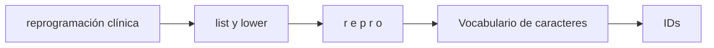

# 03 — Tokenización por carácter

## Objetivo del ejercicio

`03_por_caracter.py` convierte cada letra, espacio y acento de una frase en un token. Es el extremo opuesto a tokenizar por palabra: casi nunca se queda sin representación, pero produce muchas más unidades por texto.



## Recorrido paso a paso

### 1. Elegir una palabra larga

```python
texto = "reprogramación clínica"
```

La palabra incluye acento y muchas letras. Para un tokenizador por palabra podría ser una unidad desconocida; para uno por carácter se descompone siempre en piezas disponibles.

### 2. Crear unidades mínimas

```python
tokens = list(texto.lower())
```

`list` recorre la cadena y devuelve un elemento por carácter. El espacio también aparece como token. El modelo necesita alguna forma de saber dónde termina una palabra y empieza otra.

### 3. Construir IDs

```python
vocabulario = {caracter: indice for indice, caracter in enumerate(sorted(set(tokens)), start=1)}
ids = [vocabulario[caracter] for caracter in tokens]
```

El proceso es equivalente al de palabra, pero la unidad cambia. Con pocos símbolos es posible representar casi cualquier texto del mismo alfabeto, incluso nombres no vistos.

| Propiedad | Por palabra | Por carácter |
|---|---|---|
| Unidad | Palabra completa | Letra, espacio o símbolo. |
| Palabra nueva | Puede ser desconocida | Se compone con caracteres conocidos. |
| Longitud de secuencia | Menor | Mucho mayor. |
| Contexto por token | Más semántico | Más elemental. |

## Por qué la longitud importa

Transformers comparan tokens entre sí mediante atención. Más tokens implica más posiciones, más memoria y más costo. Para una palabra larga, el enfoque por carácter preserva cobertura pero exige que el modelo aprenda relaciones largas para reconstruir significado.

## Uso en audio

En ASR puede ser útil cuando se necesita cubrir alfabetos, nombres o palabras nuevas. Sin embargo, los sistemas modernos suelen preferir subwords: equilibran cobertura de caracteres y eficiencia de palabras frecuentes.

## Práctica

Cambialo por un apellido poco usual. Contá caracteres y compará el número con el resultado de `02_por_palabra.py`. Después identificá cómo se representaría un emoji o un símbolo no incluido en el vocabulario.
