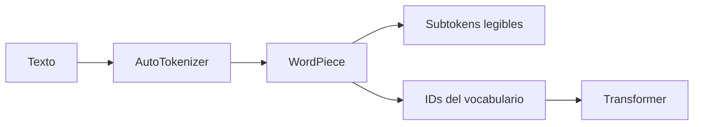

# 04 — Tokenización subword real con Hugging Face

## Objetivo del ejercicio

`04_subword_huggingface.py` usa `AutoTokenizer` y el vocabulario de BERT multilingüe para aplicar tokenización WordPiece real. El enfoque subword es el punto medio entre palabra y carácter: conserva unidades frecuentes completas cuando puede y divide las desconocidas en partes reutilizables.



## Recorrido paso a paso

### 1. Importar el componente correcto

```python
from transformers import AutoTokenizer
```

No se carga un modelo de lenguaje completo. `AutoTokenizer` recupera el vocabulario y las reglas para transformar texto en piezas e IDs. Esto hace el ejercicio más liviano y enfocado.

### 2. Cargar un vocabulario multilingüe

```python
tokenizador = AutoTokenizer.from_pretrained("bert-base-multilingual-cased")
```

`from_pretrained` descarga el recurso la primera vez y luego lo usa desde caché. El modelo elegido utiliza WordPiece y reconoce muchos idiomas, incluida la escritura latina con acentos. El sufijo `cased` indica que conserva diferencias de mayúsculas y minúsculas.

### 3. Ver subtokens y IDs

```python
subtokens = tokenizador.tokenize(texto)
ids = tokenizador.encode(texto, add_special_tokens=False)
```

`tokenize` es didáctico: permite ver fragmentos como continuaciones con `##`. `encode` produce enteros del vocabulario, que son la entrada que realmente consume el Transformer. `add_special_tokens=False` evita agregar tokens de inicio y fin para concentrarse en la frase.

| Método | Resultado | Uso docente |
|---|---|---|
| `tokenize(texto)` | Lista de subtokens | Entender cómo se fragmenta una palabra. |
| `encode(texto, ...)` | Lista de IDs | Conectar tokens con entrada numérica. |
| `len(subtokens)` | Cantidad de piezas | Comparar costo de secuencia. |

## Comparación de los tres enfoques

| Enfoque | Ejemplo de unidad | Palabra nueva | Longitud | Uso típico |
|---|---|---|---|---|
| Palabra | `hiperpersonalización` | Puede ser `[UNK]` | Corta | Sistemas simples con vocabulario cerrado. |
| Carácter | `h`, `i`, `p` | Siempre se compone | Larga | Cobertura máxima de símbolos. |
| Subword | `hiper`, `##personal` | Se divide en partes | Intermedia | Transformers modernos y ASR. |

## Conexión con L2

Después de ASR, una transcripción suele pasar por tokenización antes de clasificación, resumen o extracción. El tokenizador no corrige el audio: representa la hipótesis textual para el modelo posterior. Si Whisper entendió una frecuencia incorrecta, un tokenizer eficiente no elimina ese riesgo.

## Práctica

Probá una palabra inventada y compará las tres salidas: palabra completa, caracteres y subtokens. Registrá cantidad de unidades y discutí cuál método equilibraría mejor cobertura y costo para una gran colección de transcripciones.
