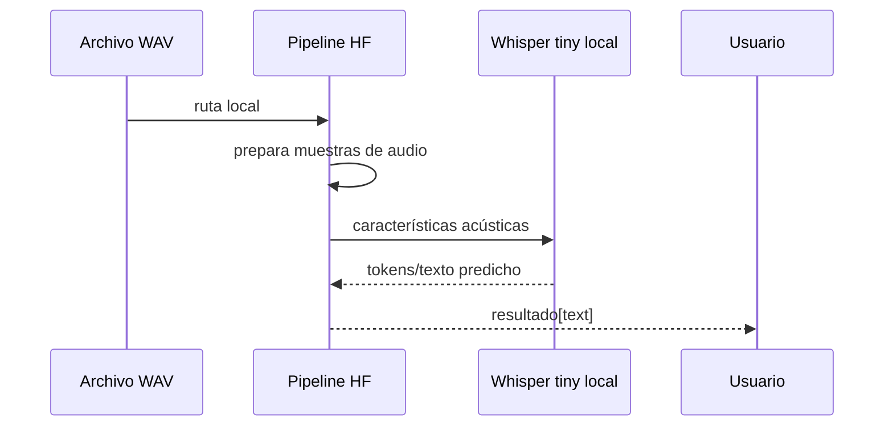

# 00 — ASR local con Transformers

## Objetivo

`00_asr_local.py` usa el pipeline de Hugging Face con `openai/whisper-tiny` en CPU. Lee WAV con módulos de Python, lo convierte a muestras y evita que Windows necesite `ffmpeg` para abrir el archivo.


## Lectura del código

```python
# Crea una tarea de reconocimiento de voz; device=-1 significa CPU.
reconocedor = pipeline(
    "automatic-speech-recognition",
    model="openai/whisper-tiny",
    device=-1,
)

# Ejecuta el modelo local sobre la ruta del audio.
resultado = reconocedor(str(ruta_audio))
print(resultado["text"])
```

| Parámetro | Significado | Consecuencia |
|---|---|---|
| `automatic-speech-recognition` | Tarea | Selecciona el tipo de procesamiento. |
| `whisper-tiny` | Modelo compacto | Ágil para clase, menos preciso que variantes mayores. |
| `device=-1` | CPU | No requiere GPU, pero puede tardar. |
| `resultado["text"]` | Texto reconocido | Insumo para etapas posteriores. |

## Comparación conceptual

| Opción | Ventaja | Decisión apropiada |
|---|---|---|
| API | Infraestructura administrada | Prototipo conectado con credenciales. |
| Modelo local | Privacidad y funcionamiento sin API | Demo offline o datos sensibles. |

## Práctica

Ejecutá con una variante limpia y otra ruidosa. El objetivo no es que `tiny` sea perfecto, sino comprender que la calidad se mide después.

---

## Recorrido del código, paso a paso

### 1. Resolver el audio desde la raíz del curso

```python
raiz = Path(__file__).resolve().parents[4]
audio = raiz / "02_python_puro/.../indicacion_medica.wav"
```

La ruta apunta al mismo golden case utilizado por las demás partes de L2. Esto permite comparar un modelo local y un servicio remoto sobre exactamente el mismo input, en lugar de comparar ejemplos distintos.

### 2. Declarar una tarea de alto nivel

```python
transcriptor = pipeline(
    "automatic-speech-recognition",
    model="openai/whisper-tiny",
    device=-1,
)
```

`pipeline` reúne preprocesamiento, carga del modelo y decodificación. La tarea `automatic-speech-recognition` indica que recibirá audio y debe devolver texto. `device=-1` elige CPU: maximiza accesibilidad en clase, aunque no velocidad.

| Parámetro | Decisión del ejercicio | Efecto pedagógico |
|---|---|---|
| Tarea ASR | Voz a texto | No confundir con clasificación o generación. |
| `whisper-tiny` | Modelo pequeño | Descarga y demo manejables. |
| `device=-1` | CPU | Funciona sin GPU, depende del equipo. |
| Ruta de audio | Golden case compartido | Hace posible una comparación justa. |

### 3. Ejecutar y extraer el campo relevante

```python
resultado = transcriptor(str(audio))
print(resultado["text"])
```

La ruta se pasa como `str` porque el pipeline espera una referencia de archivo compatible. `resultado` puede contener otros metadatos según la tarea; el ejercicio muestra solo `text` para concentrarse en la hipótesis ASR.



## Qué cambia al ejecutar localmente

| Dimensión | Modelo local | Servicio remoto |
|---|---|---|
| Datos | Permanecen en el equipo durante inferencia | Se envían al proveedor. |
| Inicio | Descarga pesos una vez | Requiere red y autenticación. |
| Latencia | Depende de CPU/GPU disponibles | Depende de red, cola y proveedor. |
| Escalado | Lo administra el equipo propio | Lo administra el servicio. |

## Errores frecuentes

| Síntoma | Causa probable | Primer control |
|---|---|---|
| Descarga lenta | Pesos no están en caché | Esperar la primera descarga y revisar conexión. |
| Memoria insuficiente | Modelo o audio demasiado grandes | Usar un modelo menor o segmentar. |
| Texto pobre | Ruido, idioma o modelo compacto | Medir WER; no adivinar la causa. |
| Ruta inexistente | Árbol de carpetas distinto | Imprimir `audio` y validar el archivo. |

### Por qué este ejemplo ya no requiere ffmpeg

Cuando se entrega una ruta de archivo directamente al pipeline, Transformers invoca `ffmpeg` para decodificarla. El script ahora abre el WAV PCM con `wave`, normaliza sus enteros con NumPy y entrega al pipeline un diccionario `{"raw": muestras_16khz, "sampling_rate": 16000}`. Así el pipeline recibe audio ya decodificado.

| Paso nuevo | Qué hace | Razón |
|---|---|---|
| `wave.open(...)` | Lee los bytes PCM del WAV | Evita un ejecutable externo. |
| `np.frombuffer(..., int16)` | Convierte bytes en muestras | Pasa de archivo a números. |
| División por `32768.0` | Normaliza a `[-1, 1]` aproximadamente | Formato esperado por el preprocesador. |
| `np.interp(...)` | Reescala 22.050 Hz a 16.000 Hz | Alinea la frecuencia con Whisper. |
| Diccionario `raw` | Entrega muestras ya cargadas | Transformers no necesita abrir el archivo. |

El siguiente paso lógico no es “mejorar el prompt”; es comparar la hipótesis con una referencia usando WER.
