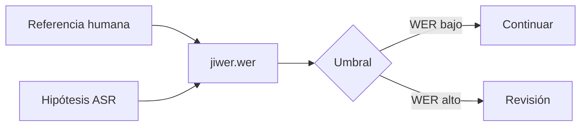
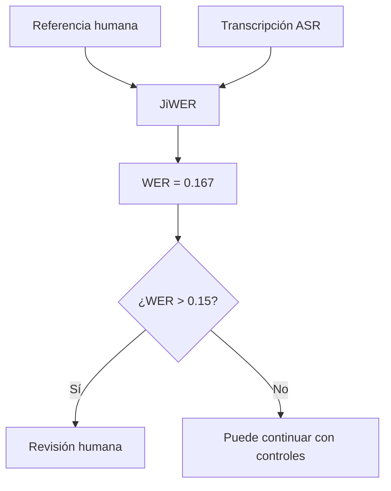

# 01 — WER con la biblioteca JiWER

## Objetivo

`01_wer_jiwer.py` calcula WER mediante JiWER y decide si una transcripción puede continuar o debe revisarse. Es la versión práctica de la métrica explicada en el ejercicio manual.



## Código esencial

```python
# Calcula la distancia normalizada entre referencia e hipótesis.
tasa_error = wer(texto_referencia, texto_hipotesis)

# Convierte una métrica técnica en una decisión visible.
estado = "aceptar" if tasa_error <= 0.20 else "revisar"
print({"wer": round(tasa_error, 3), "estado": estado})
```

| Concepto | En el script | Interpretación |
|---|---|---|
| Referencia | Texto humano | Patrón contra el que se compara. |
| Hipótesis | Salida del ASR | Resultado a evaluar. |
| Umbral | `0.20` | Regla de negocio, no verdad universal. |
| Estado | aceptar/revisar | Hace accionable la medición. |

## Teoría: umbrales por contexto

| Contexto | Umbral orientativo | Control extra |
|---|---:|---|
| Notas internas | Tolerante | Revisión aleatoria. |
| Soporte al cliente | Medio | Auditoría de intenciones. |
| Medicina, contratos o pagos | Muy estricto | Validar entidades críticas. |

## Práctica

Cambiá una palabra general y luego un número de una dosis. El WER puede cambiar poco en ambos casos; el segundo necesita una regla adicional.

---

## Recorrido del código, paso a paso

### 1. Separar verdad de predicción

```python
referencia = "tomar una tableta cada ocho horas"
transcripcion = "tomar una tableta cada seis horas"
```

La referencia es el texto que una persona declaró correcto. La transcripción es la hipótesis del ASR. Mantener ambas variables separadas es esencial: si una se deriva de la otra, la métrica pierde sentido.

### 2. Delegar la distancia de edición en JiWER

```python
error = wer(referencia, transcripcion)
```

JiWER normaliza y calcula la distancia de edición de palabras. El resultado es un número; no identifica automáticamente qué palabra importa más. En este caso representa una sustitución (`ocho` → `seis`) dividida por la cantidad de palabras de referencia.

### 3. Mostrar valor técnico y lectura humana

```python
print({"wer": round(error, 3), "porcentaje": f"{error * 100:.1f}%"})
```

El mismo valor aparece como proporción (`0.167`) y porcentaje (`16.7%`). Mostrar ambos evita que el alumno confunda WER con una probabilidad de confianza. Es una métrica del par referencia–hipótesis actual.

### 4. Convertir la métrica en una regla visible

```python
umbral = 0.15
print("Revisión humana:", error > umbral)
```

El umbral no lo impone JiWER ni el modelo: es una decisión de producto o dominio. Aquí es intencionalmente estricto para generar la discusión de que una indicación médica con frecuencia errónea no debe pasar automáticamente.



## Métrica global vs riesgo local

| Situación | WER | Riesgo | Regla recomendada |
|---|---:|---|---|
| Error de puntuación | Puede no variar | Bajo | Normalizar según caso. |
| Palabra irrelevante | Bajo | Bajo a medio | Registrar y muestrear. |
| Dosis o frecuencia | Puede ser bajo | Alto | Bloquear y revisar entidad. |
| Nombre de persona o empresa | Puede ser bajo | Alto | Comparar con fuente o catálogo. |

## Límites técnicos

WER puede superar 1 si hay muchas inserciones. Tampoco entiende sinónimos: “comprimido” y “tableta” cuentan como distintos aunque para una persona se parezcan. Por eso la evaluación profesional combina métricas, golden cases de dificultad conocida y revisión contextual.

## Extensión de clase

Creá tres referencias: limpia, ruido y audio entrecortado. Calculá WER para cada caso y agregá una columna manual llamada `termino_critico_preservado`. Así se enseña que medir calidad es más que imprimir un único número.
