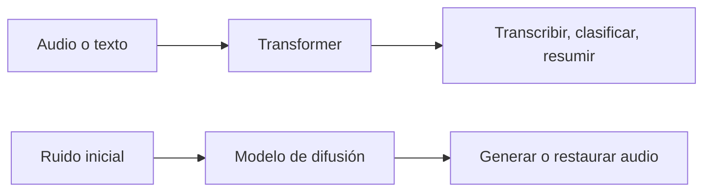
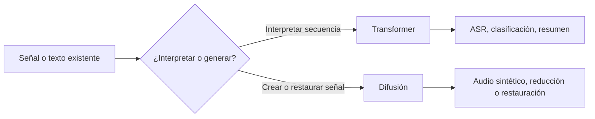

# 00 — Transformer y difusión no resuelven lo mismo

## Objetivo

`00_transformer_vs_diffusion.py` presenta una comparación simple. Ambos aparecen en IA de audio, pero su propósito es distinto: Transformer interpreta secuencias; difusión genera o restaura señales mediante un proceso iterativo.



## Lectura del código

El archivo usa un diccionario y un `print()` para exponer una decisión técnica sin ocultarla detrás de una aplicación grande.

```python
# Declara explícitamente la tarea adecuada para cada arquitectura.
comparacion = {
    "transformer": "comprende y transforma secuencias",
    "difusion": "genera o restaura una señal de manera iterativa",
}
print(comparacion)
```

| Arquitectura | Entrada típica | Salida típica | Caso de L2 |
|---|---|---|---|
| Transformer | Tokens o características de audio | Texto, etiquetas o resumen | ASR y clasificación. |
| Difusión | Ruido y condiciones | Señal nueva o limpiada | Audio sintético o restauración. |

## Teoría

Un Transformer usa atención para relacionar partes de una secuencia. Un modelo de difusión aprende a invertir gradualmente un proceso de agregar ruido. No se elige “el más moderno”; se elige el que responde al problema.

## Pregunta para clase

Si se necesita transcribir una llamada, ¿qué familia usarías? Si se necesita generar una locución artificial, ¿cuál encaja mejor? Justificá con la tabla.

---

## Recorrido del código, paso a paso

### 1. Declarar decisiones técnicas como datos

```python
tareas = {
    "transcribir una llamada": "Transformer",
    "clasificar una intención": "Transformer",
    "generar un efecto de sonido": "Difusión",
    "restaurar audio degradado": "Difusión",
}
```

El diccionario no implementa ninguna red neuronal: expresa una regla de selección. Es importante porque antes de instalar una librería o entrenar un modelo, se debe aclarar qué transformación se busca realizar.

### 2. Mostrar cada relación tarea–arquitectura

```python
for tarea, arquitectura in tareas.items():
    print(f"{tarea:30} -> {arquitectura}")
```

El bucle hace visibles todas las decisiones. El formato de 30 caracteres no afecta a la IA; solo alinea la salida para comparar casos en la terminal. Es un buen ejemplo de código didáctico: la tecnología central no queda escondida detrás de abstracciones.

### 3. Seleccionar un caso para discutir costo

```python
tarea_elegida = "generar un efecto de sonido"
print("Selección:", tareas[tarea_elegida])
```

La variable permite cambiar un único caso y forzar una justificación. Para un producto real se agregarían duración, latencia permitida, hardware, datos disponibles y forma de evaluación.

## Qué problema resuelve cada familia



| Pregunta de diseño | Transformer | Difusión |
|---|---|---|
| Operación principal | Relacionar elementos mediante atención. | Invertir un proceso gradual de ruido. |
| Salida frecuente en L2 | Texto o etiqueta. | Señal de audio generada/restaurada. |
| Tiempo de inferencia | Suele requerir una pasada o decodificación. | Suele requerir varios pasos iterativos. |
| Métrica típica | WER, accuracy, F1. | Calidad perceptual, fidelidad, preferencia humana. |

## Por qué “audio” no define una arquitectura

Una llamada, una melodía y un clip ruidoso son audio, pero plantean problemas distintos. ASR busca interpretar voz; restauración busca recuperar una señal; generación crea una señal que no existía. Elegir por tipo de archivo en vez de por objetivo lleva a implementaciones costosas o inútiles.

## Actividad de diseño

Para cada caso, completá la cadena: **objetivo → entrada → salida → arquitectura inicial → métrica → control humano**. Por ejemplo: “transcribir una llamada → WAV → texto → Transformer/Whisper → WER → revisar números críticos”.
