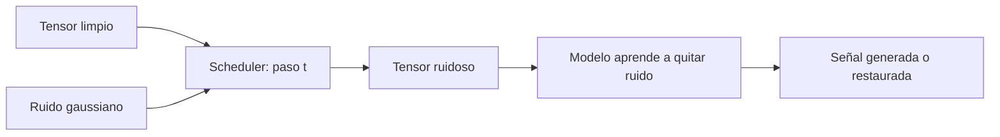
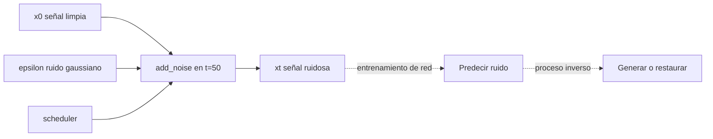

# 01 — El scheduler en un proceso de difusión

## Objetivo

`01_scheduler.py` muestra cómo `DDPMScheduler` agrega ruido a un tensor de ejemplo en un paso temporal. El scheduler define cuánto ruido corresponde a cada etapa y organiza el camino de ruido a señal.



## Lectura del código

```python
# Construye una señal pequeña y un ruido de la misma forma.
senal_limpia = torch.linspace(-1, 1, steps=8).unsqueeze(0)
ruido = torch.randn_like(senal_limpia)

# Mezcla señal y ruido según un instante del proceso de difusión.
senal_ruidosa = scheduler.add_noise(senal_limpia, ruido, timestep)
print(senal_ruidosa)
```

| Objeto | Papel en el ejemplo |
|---|---|
| `senal_limpia` | Dato ideal que se desea recuperar o modelar. |
| `ruido` | Perturbación aleatoria. |
| `timestep` | Momento o intensidad del proceso. |
| `scheduler` | Aplica la regla de ruido por paso. |

## Teoría

En entrenamiento se toma una señal real y se la degrada gradualmente. El modelo aprende a estimar el ruido o la señal limpia. En generación se comienza desde ruido y se invierte el proceso paso por paso.

| En ASR | En difusión |
|---|---|
| Se busca interpretar una señal existente. | Se busca sintetizar o restaurar una señal. |
| La métrica puede ser WER. | Se evalúa fidelidad o calidad perceptual. |

## Práctica

Cambiá el `timestep` y observá cómo varía el tensor. Conectá ese cambio con la idea de “más lejos de la señal limpia”.

---

## Recorrido del código, paso a paso

### 1. Representar una señal como tensor

```python
audio_limpio = torch.linspace(-1, 1, steps=16).reshape(1, 1, 16)
```

El audio real suele ser una secuencia de muestras numéricas. Aquí se usa una recta entre `-1` y `1` para no depender de archivos ni de un codec. La forma `(1, 1, 16)` significa, de manera simplificada: lote de tamaño 1, un canal y 16 muestras.

### 2. Crear ruido compatible

```python
ruido = torch.randn_like(audio_limpio)
```

`randn_like` genera ruido gaussiano con la misma forma, tipo y dispositivo que la señal limpia. Esa compatibilidad permite mezclar ambas sin errores de dimensiones.

### 3. Definir el calendario de ruido

```python
scheduler = DDPMScheduler(num_train_timesteps=100)
instante = torch.tensor([50])
```

El scheduler no es la red neuronal. Define la pauta de cuánta señal y cuánto ruido se combinan en cada paso. `100` especifica la cantidad de pasos del proceso de entrenamiento simulado. El instante 50 está a mitad de camino y por eso ilustra una señal parcialmente degradada.

### 4. Aplicar el paso directo de difusión

```python
audio_ruidoso = scheduler.add_noise(audio_limpio, ruido, instante)
```

Esta operación implementa conceptualmente:

\[
x_t = \sqrt{\bar{\alpha}_t}x_0 + \sqrt{1-\bar{\alpha}_t}\epsilon
\]

`x_0` es audio limpio, `ε` el ruido y `x_t` la versión degradada en el paso `t`. Durante entrenamiento, una red aprende a estimar el ruido o reconstruir la señal. Este script solo muestra la fase directa: todavía no genera audio nuevo.

### 5. Imprimir estadísticos, no una historia inventada

```python
print("Media limpia:", round(audio_limpio.mean().item(), 3))
print("Media ruidosa:", round(audio_ruidoso.mean().item(), 3))
print("Shape:", tuple(audio_ruidoso.shape))
```

La media es una observación simple y `shape` confirma que el scheduler no cambió la estructura del lote. No alcanza para decir que el audio “suena bien”; para eso se necesitan reconstrucción, escucha o métricas de calidad apropiadas.



| Variable | Forma | Significado | Al modificarla |
|---|---|---|---|
| `audio_limpio` | `(1,1,16)` | Señal ideal simplificada | Cambia el dato de origen. |
| `ruido` | Igual a la señal | Perturbación aleatoria | Cambia el ejemplo en cada ejecución. |
| `instante` | `(1,)` | Nivel temporal de degradación | Cambia cuánto ruido domina. |
| `audio_ruidoso` | Igual a la señal | Input que la red aprendería a denoiser | Debe conservar shape. |

## Experimento guiado

Ejecutá con instantes 10, 50 y 90. Registrá media y una porción del tensor. La expectativa no es una media siempre mayor o menor: el ruido es aleatorio. La observación importante es que al avanzar el proceso la señal original pierde presencia relativa.
