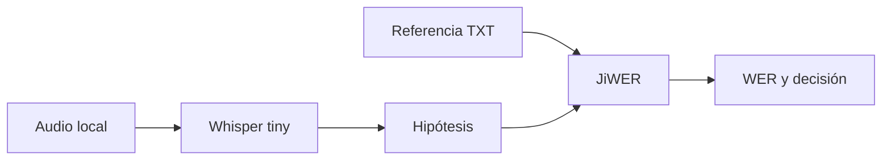
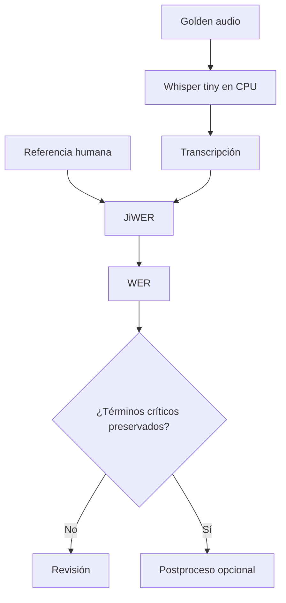

# Pipeline local: ASR + WER con Hugging Face

## Objetivo

`pipeline_audio_local.py` usa un modelo Whisper pequeño local para transcribir, lee la referencia humana completa del mismo caso desde `data/transcripts/` y calcula WER. Es el integrador local de datos, ASR y evaluación.



## Lectura del código

| Paso | Bloque | Resultado |
|---|---|---|
| 1 | Resuelve ruta del audio | Entrada reproducible. |
| 2 | Crea `pipeline("automatic-speech-recognition")` | ASR local. |
| 3 | Lee referencia | Base para evaluar. |
| 4 | `wer(...)` | Medición cuantitativa. |
| 5 | `print(...)` | Resultado comprensible. |

```python
# Evalúa la transcripción con la referencia humana completa del mismo audio.
referencia = ruta_referencia.read_text(encoding="utf-8").strip().lower()
tasa_error = wer(referencia, transcripcion)
```

## Teoría: un pipeline reproducible

| Decisión | Razón |
|---|---|
| Audio en `data/` | Todas las personas prueban el mismo caso. |
| Referencia separada | El modelo no conoce la respuesta esperada. |
| Modelo explícito | Se puede comparar otra variante después. |
| WER impreso | La mejora se verifica, no se supone. |

## Práctica

Ejecutá el flujo con los tres escenarios. Después sustituí el modelo por otra variante y registrá tiempo, WER y observaciones cualitativas.

---

## Recorrido completo del pipeline

### 1. Fijar un caso reproducible y su referencia

```python
audio = raiz / "02_python_puro/.../indicacion_medica.wav"
referencia = "tomar un comprimido cada ocho horas"
```

El WAV representa la entrada real. La referencia es independiente y permite evaluar. Esta pareja forma un *golden case*: un caso pequeño, conocido y repetible con el que se pueden comparar modelos, versiones o condiciones de audio.

### 2. Ejecutar ASR en la propia máquina

```python
transcriptor = pipeline(
    "automatic-speech-recognition",
    model="openai/whisper-tiny",
    device=-1,
)
resultado = transcriptor(str(audio))
```

El pipeline puede descargar pesos en la primera ejecución y luego usar caché. El script no necesita clave de API, pero sí dependencias, almacenamiento, memoria y tiempo de CPU. Esa es la diferencia operativa clave respecto del ejemplo remoto.

### 3. Normalizar solo lo necesario para la métrica

```python
transcripcion = resultado["text"].strip().lower()
```

`strip()` elimina espacios al comienzo y final; `lower()` evita contar mayúsculas como diferencias. Estas reglas deben aplicarse de modo coherente a referencia e hipótesis. Si se normaliza agresivamente una sola parte, el WER deja de ser comparable.

### 4. Medir sin que el LLM oculte el error

```python
print("WER:", round(wer(referencia, transcripcion), 3))
```

No hay LLM en este integrador porque el foco es comprobar la calidad de ASR local. Primero se valida el eslabón acústico; recién después tendría sentido sumar LangChain para resumir o clasificar el texto.



## Lectura de resultados

| Resultado observado | Interpretación posible | Próximo experimento |
|---|---|---|
| WER bajo y frase correcta | El caso está bien resuelto por este modelo | Probar ruido y otras voces. |
| WER bajo pero número incorrecto | Métrica global insuficiente | Auditar números y frecuencia. |
| WER alto | Audio, modelo o referencia requieren revisión | Escuchar audio y verificar alineación. |
| Ejecución lenta | CPU o modelo son cuello de botella | Medir tiempo y probar otra variante. |

## Comparación experimental sugerida

| Variable que cambia | Mantener constante | Evidencia que registrar |
|---|---|---|
| `whisper-tiny` vs `whisper-base` | Mismo WAV y referencia | WER, segundos, RAM aproximada. |
| Limpio vs ruidoso | Mismo modelo | WER y palabras afectadas. |
| Local vs API | Mismo golden case | Latencia, privacidad, WER y costo. |

El objetivo no es proclamar un ganador general, sino argumentar con datos qué alternativa conviene para un contexto específico.

## Nota de ejecución en Windows

El script no entrega el nombre del WAV directamente a Transformers, porque esa ruta requiere `ffmpeg` para decodificarse. En cambio, usa `wave` y NumPy para leer el WAV PCM, normalizarlo y reescalarlo de 22.050 Hz a 16.000 Hz antes de llamar a Whisper.

```python
resultado = transcriptor({
    "raw": muestras_16khz,
    "sampling_rate": frecuencia_modelo,
})
```

Eso hace que el ejemplo funcione sin instalar `ffmpeg`. Está diseñado para los WAV PCM mono incluidos en L2; para MP3, M4A, estéreo o codecs distintos conviene instalar `ffmpeg` o usar una biblioteca de decodificación especializada.
