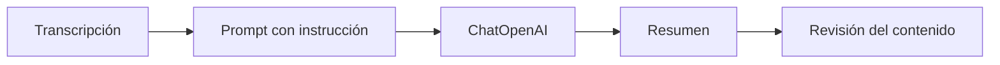
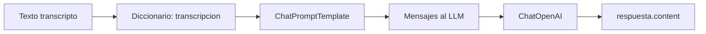

# 00 — Resumir una transcripción con LangChain

## Objetivo

`00_resumir_transcripcion.py` conecta un `ChatPromptTemplate` con `ChatOpenAI` mediante el operador `|`. Enseña el rol correcto del LLM en este módulo: trabajar **después** del ASR sobre una transcripción ya disponible.



## Lectura del código

```python
# Define la instrucción y el lugar donde se inserta el texto de ASR.
prompt = ChatPromptTemplate.from_template(
    "Resumí en una oración: {transcripcion}"
)

# Conecta prompt y modelo; invoke entrega los datos concretos.
cadena = prompt | ChatOpenAI(model=modelo)
respuesta = cadena.invoke({"transcripcion": transcripcion})
print(respuesta.content)
```

| Componente | Responsabilidad | No hace |
|---|---|---|
| `ChatPromptTemplate` | Formula la tarea | No transcribe audio. |
| `ChatOpenAI` | Genera una respuesta textual | No confirma que ASR fue correcto. |
| `invoke` | Ejecuta con un input | No guarda la salida por sí solo. |
| `print` | Muestra el resultado | No valida datos críticos. |

## Teoría: por qué LangChain aparece después del ASR

El audio tiene una representación continua y el LLM trabaja con texto tokenizado. Separar ambas etapas permite medir la transcripción antes de resumirla. Si ASR escribió “dos mil” donde se dijo “doce mil”, un resumen fluido puede ocultar el error en vez de corregirlo.

| Buena práctica | Ejemplo |
|---|---|
| Instrucción acotada | “Resumí en una oración”. |
| Input visible | Imprimir la transcripción antes del resumen. |
| Regla de revisión | No resumir automáticamente si WER es alto. |

## Práctica

Probá una transcripción correcta y otra con un dato crítico cambiado. Revisá que el modelo resume lo recibido: no tiene acceso mágico al audio original.

---

## Recorrido del código, paso a paso

### 1. El texto de entrada simula una etapa ASR ya terminada

```python
transcripcion = "El paciente debe tomar un comprimido cada ocho horas y volver a control el lunes."
```

La variable no es audio ni un objeto Whisper: es texto plano. Eso permite aislar la segunda parte del pipeline. En una aplicación real se reemplazaría por `respuesta.text` del transcriptor, pero mantenerlo fijo vuelve el ejercicio rápido y repetible.

| Antes de este script | Este script | Después de este script |
|---|---|---|
| ASR convierte voz a texto | LLM resume texto | Persona valida si corresponde actuar |
| Puede introducir errores acústicos | Puede organizar la información | No debe confiar ciegamente en fluidez |

### 2. Declarar la tarea en el prompt

```python
prompt = ChatPromptTemplate.from_template(
    "Resumí en una oración: {transcripcion}"
)
```

`{transcripcion}` es un marcador. Aún no contiene el dato concreto: define el contrato de entrada que se entregará más adelante. La instrucción es deliberadamente pequeña para que se vea el rol de cada pieza.

### 3. Construir una cadena explícita

```python
cadena = prompt | ChatOpenAI(model="gpt-4o-mini", temperature=0)
```

El operador `|` compone dos *runnables*: el prompt transforma un diccionario en mensajes y el wrapper del modelo transforma esos mensajes en una respuesta. La cadena no ejecuta nada al crearse; solo describe el flujo.

### 4. Ejecutar con el input real

```python
respuesta = cadena.invoke({"transcripcion": transcripcion})
print(respuesta.content)
```

`invoke()` es el momento de ejecución. El nombre de clave debe coincidir exactamente con el marcador del prompt. `respuesta.content` recupera el texto que generó el modelo; imprimirlo hace el resultado visible en clase.



## Por qué esta separación es importante

| Error común | Por qué es un problema | Corrección |
|---|---|---|
| Pedir al LLM “arreglar” el audio | El LLM no recibió la señal original. | Primero revisar ASR contra evidencia. |
| Resumir antes de medir calidad | El resumen puede esconder una palabra incorrecta. | WER y términos críticos antes. |
| Prompt ambiguo | El modelo puede inventar, extender o diagnosticar. | Pedir una única acción y límites claros. |
| Tomar el resumen como dato fuente | Se pierde trazabilidad. | Guardar también transcripción original. |

## Extensión docente segura

Después de calcular WER, agregá una condición conceptual: si el valor supera el umbral, imprimir “revisión humana requerida” y no invocar la cadena. Así el estudiante ve que la orquestación no consiste en llamar muchos modelos, sino en decidir cuándo cada etapa puede continuar.
