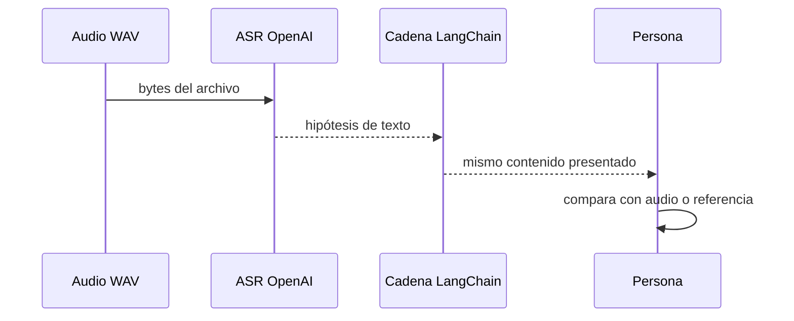

# 00 — Transcribir un audio con Whisper

## Qué enseña este archivo

`00_transcribir_whisper.py` toma un archivo `.wav`, lo envía al modelo de transcripción y muestra el texto devuelto. Es el primer paso real de un pipeline de audio: **audio no estructurado → texto que se puede revisar y procesar**.


## Lectura del código

| Bloque | Qué hace | Por qué importa |
|---|---|---|
| `load_dotenv()` | Carga la clave desde el `.env` global | Evita pegar credenciales en el código. |
| `OpenAI()` | Crea el cliente de API | Es el puente con el servicio de ASR. |
| `open(..., "rb")` | Abre bytes de audio | Un audio no se lee como texto. |
| `audio.transcriptions.create(...)` | Pide la transcripción | Aquí ocurre el reconocimiento de voz. |
| `print(transcripcion.text)` | Hace visible el resultado | Permite compararlo con la referencia humana. |

```python
# Abre el audio como bytes y lo entrega al modelo de ASR.
with open(ruta_audio, "rb") as archivo_audio:
    transcripcion = cliente.audio.transcriptions.create(
        model="gpt-4o-mini-transcribe",
        file=archivo_audio,
    )
```

## Idea teórica

ASR (*Automatic Speech Recognition*) transforma una señal acústica en palabras. El resultado no es necesariamente correcto: acentos, ruido, nombres propios, números y pausas pueden cambiar la salida. Una transcripción es un dato a validar, no una verdad automática.

| Situación | Riesgo | Acción docente |
|---|---|---|
| Audio limpio y corto | Bajo | Leer el texto y comprobarlo. |
| Audio con ruido | Medio | Comparar con el audio original. |
| Dosis, fechas o montos | Alto | Exigir revisión humana. |

## Práctica en clase

1. Ejecutá el script con `indicacion_medica.wav`.
2. Cambiá la ruta por `llamada_soporte.wav`.
3. Abrí el archivo de referencia y marcá una palabra que el modelo podría confundir.

> La transcripción resuelve “qué se dijo”; todavía no resuelve “qué significa” ni “qué decisión tomar”.

---

## Recorrido del script, paso a paso

### 1. Cargar la configuración antes de crear clientes

```python
from dotenv import load_dotenv
load_dotenv()
```

`load_dotenv()` busca el archivo `.env` y coloca sus pares `NOMBRE=valor` en las variables de entorno del proceso. El cliente `OpenAI()` lee `OPENAI_API_KEY` de allí. La clave no viaja dentro del audio ni debe quedar escrita en el `.py`.

| Entrada | Transformación | Salida | Si falla |
|---|---|---|---|
| Archivo `.env` con `OPENAI_API_KEY` | `load_dotenv()` la incorpora al proceso | Credencial disponible para el cliente | La API rechaza la llamada por autenticación. |

### 2. Construir la ruta de manera reproducible

```python
raiz = Path(__file__).resolve().parents[4]
audio = raiz / "02_python_puro/.../indicacion_medica.wav"
```

`__file__` representa este script; `resolve()` lo transforma en una ruta absoluta. Luego `parents[4]` sube hasta la raíz del curso. Esto evita depender de la carpeta desde la que se ejecuta el comando. `Path` también concatena partes de una ruta de forma portable, sin escribir barras a mano.

Antes de llamar a la API, preguntá en clase: **¿existe el archivo?, ¿es el caso de prueba que creemos estar usando?, ¿qué información sensible contiene?**

### 3. Abrir bytes, no texto

```python
with audio.open("rb") as archivo_audio:
```

`rb` significa *read binary*. Un WAV contiene cabeceras y muestras numéricas, no caracteres. El bloque `with` cierra el archivo incluso si la solicitud falla; por eso es preferible a abrirlo y olvidarse de cerrarlo.

### 4. Pedir reconocimiento de voz

```python
transcripcion = cliente.audio.transcriptions.create(
    model="gpt-4o-mini-transcribe",
    file=archivo_audio,
)
```

Este es el único bloque que entiende la señal acústica. La salida posee `transcripcion.text`: una hipótesis textual. El modelo puede inferir segmentación, puntuación o palabras parecidas, pero no conoce la intención clínica del ejercicio.

| Argumento | Por qué está | Qué no resuelve |
|---|---|---|
| `model` | Fija el modelo para repetir el experimento | No asegura exactitud absoluta. |
| `file` | Envía el contenido binario | No adjunta una referencia correcta. |
| `transcripcion.text` | Recupera la hipótesis | No informa por sí solo dónde se equivocó. |

### 5. Usar LangChain sin cambiar el significado

El prompt pide devolver solamente el texto ya transcripto. Pedagógicamente muestra que LangChain se ubica **después** de ASR; no convierte audio a texto. Esta normalización debe ser conservadora: si el prompt pidiera “mejorá” el texto, podría corregir o inventar contenido y romper la evaluación con WER.



## Diagnóstico de fallas y discusión

| Síntoma | Causa probable | Cómo comprobarlo | Acción correcta |
|---|---|---|---|
| `FileNotFoundError` | Ruta construida hacia un archivo inexistente | Imprimir `audio` y verificarlo | Corregir la ruta, no cambiar el modelo. |
| Error de API key | `.env` ausente o clave inválida | Verificar que se cargó antes de `OpenAI()` | Configurar la clave sin publicarla. |
| Palabra clínica errónea | Ruido, pronunciación o ambigüedad | Escuchar el tramo original | Marcar para revisión humana. |
| Texto más “bonito” pero distinto | Prompt de posproceso demasiado creativo | Comparar ASR vs salida LangChain | Pedir preservación literal. |

## Conexión con la teoría de L2

Este script cubre el tramo **audio → ASR → texto**. Para ser un pipeline confiable todavía faltan una referencia o golden case, una métrica como WER, reglas para términos críticos y una acción posterior. El siguiente ejercicio agrega esa medición.
