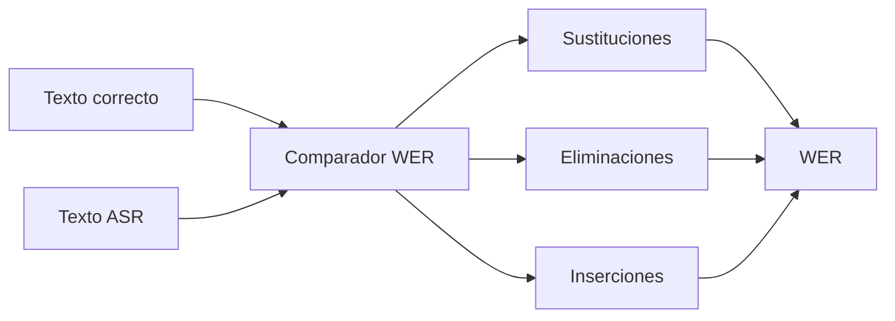
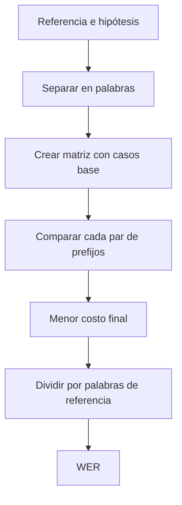

# 00 — Medir calidad con WER

## Qué enseña este archivo

`00_calcular_wer.py` compara una transcripción de referencia con una hipótesis y calcula el **Word Error Rate**. Es la métrica básica para saber si un sistema ASR mejoró o empeoró.



## Fórmula

\[
WER = \frac{S + D + I}{N}
\]

| Símbolo | Significado | Ejemplo |
|---|---|---|
| `S` | Sustituciones | “ocho” por “dos”. |
| `D` | Eliminaciones | Falta una palabra. |
| `I` | Inserciones | Aparece una palabra inexistente. |
| `N` | Palabras de referencia | Longitud del texto correcto. |

## Lectura del código

El script construye una matriz de programación dinámica. Cada celda guarda el costo mínimo para transformar un prefijo de la referencia en un prefijo de la hipótesis.

```python
# Si las palabras son iguales no se agrega error; si no, es una sustitución.
costo_sustitucion = 0 if palabra_referencia == palabra_hipotesis else 1

# El menor camino representa la cantidad mínima de operaciones necesarias.
matriz[fila][columna] = min(eliminar, insertar, sustituir)
```

| Parte | Concepto | Lectura pedagógica |
|---|---|---|
| Normalización | Minúsculas y espacios | Evita contar diferencias irrelevantes. |
| Matriz | Distancia de edición | Hace visible cómo se calcula la métrica. |
| División por `N` | Normalización | Permite comparar textos de distintos tamaños. |

## Advertencia importante

Un WER bajo no garantiza seguridad. Cambiar “8 mg” por “80 mg” puede ser un único error y, sin embargo, ser crítico. En medicina, finanzas o contratos se auditan además los términos sensibles.

## Práctica en clase

Modificá una palabra, luego eliminá una y finalmente agregá otra. Observá que cada tipo de error aumenta el numerador de la fórmula.

---

## Recorrido del algoritmo, paso a paso

### 1. Convertir frases en secuencias comparables

```python
referencia = "tomar una tableta cada ocho horas".split()
hipotesis = "tomar una tableta cada seis horas".split()
```

`split()` separa por espacios y produce listas de palabras. Así el algoritmo no compara letras: compara unidades léxicas. En el ejemplo solo cambia `ocho` por `seis`, por lo que esperamos una sustitución.

| Variable | Valor conceptual | Rol |
|---|---|---|
| `referencia` | Lo que debía decirse | Patrón humano o golden case. |
| `hipotesis` | Lo que ASR produjo | Salida que se evalúa. |
| `len(referencia)` | `N` en la fórmula | Denominador de WER. |

### 2. Preparar la matriz de distancia

```python
filas = len(referencia) + 1
columnas = len(hipotesis) + 1
distancias = [[0] * columnas for _ in range(filas)]
```

La fila `0` representa transformar una frase vacía; la columna `0` representa llegar a una hipótesis vacía. El `+ 1` reserva esos casos base. La matriz responde: “¿cuántas operaciones mínimas necesito para transformar este prefijo de referencia en este prefijo de hipótesis?”.

### 3. Inicializar inserciones y eliminaciones

```python
distancias[fila][0] = fila
distancias[0][columna] = columna
```

Para pasar de `n` palabras a ninguna se eliminan `n` palabras. Para pasar de nada a `m` palabras se insertan `m`. Estos valores constituyen los bordes desde los cuales se completa toda la matriz.

### 4. Elegir la operación más barata

```python
costo = 0 if referencia[fila - 1] == hipotesis[columna - 1] else 1
distancias[fila][columna] = min(eliminar, insertar, sustituir)
```

En cada intersección hay tres alternativas. El algoritmo conserva el menor costo acumulado, no una decisión local apresurada.

| Movimiento en la matriz | Operación | Ejemplo |
|---|---|---|
| Desde arriba | Eliminar | La referencia tenía una palabra que falta. |
| Desde la izquierda | Insertar | La hipótesis agregó una palabra. |
| Diagonal | Coincidir o sustituir | “ocho” se cambia por “seis”. |

### 5. Leer el resultado final

```python
errores = distancias[-1][-1]
wer = errores / len(referencia)
```

La esquina inferior derecha cubre las dos frases completas. En este caso hay 1 error sobre 6 palabras: `1 / 6 = 0.167`. El número no es una “confianza del modelo”; es una diferencia medida contra esta referencia concreta.



## Qué enseña y qué no enseña WER

| WER sí permite | WER no permite |
|---|---|
| Comparar dos modelos sobre el mismo conjunto. | Declarar que un audio es seguro sin inspección. |
| Detectar degradación con ruido o cortes. | Medir directamente comprensión semántica. |
| Definir una regla de revisión. | Dar el tipo de cada error sin análisis adicional. |

Para un caso médico, “ocho” por “seis” y una palabra menor tienen el mismo costo de WER, aunque su consecuencia sea muy diferente. Por eso L2 combina WER con una lista de entidades críticas: dosis, frecuencias, fechas, importes o nombres.
