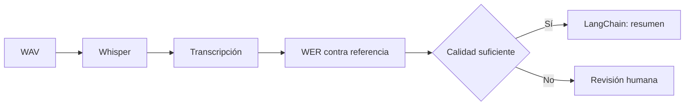
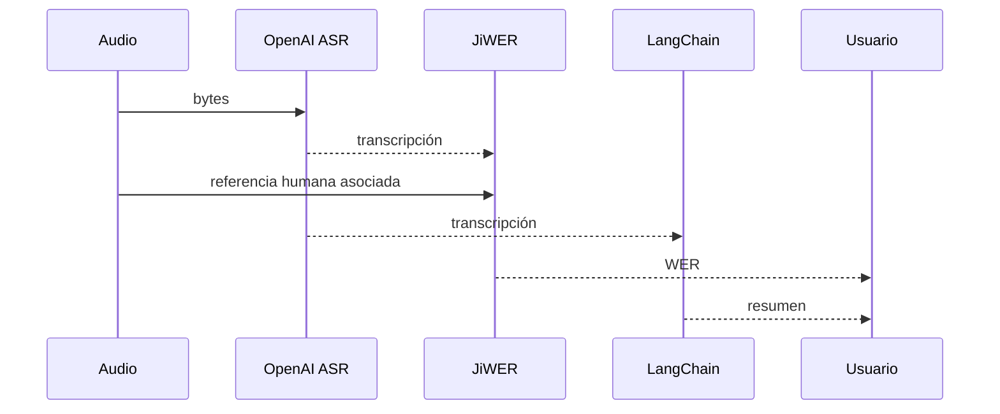

# Pipeline de audio: transcribir, medir y resumir

## Objetivo

`pipeline_audio.py` une tres aprendizajes: Whisper convierte audio en texto, WER mide su fidelidad y LangChain transforma el texto validado en una salida útil. No reemplaza una revisión humana cuando el riesgo es alto.



## Lectura guiada del código

| Etapa | Código asociado | Resultado |
|---|---|---|
| Configuración | `load_dotenv()` | Credenciales fuera del repositorio. |
| ASR | `audio.transcriptions.create` | Texto de Whisper. |
| Evaluación | `wer(referencia, transcripcion)` | Número que mide diferencia. |
| Posproceso | `prompt | ChatOpenAI` | Resumen breve del texto. |
| Decisión | Umbral de WER | Aceptar o revisar. |

```python
# Encadena una instrucción con el modelo para trabajar sobre texto, no sobre audio.
cadena = prompt | ChatOpenAI(model=modelo)
respuesta = cadena.invoke({"transcripcion": texto})
```

## Teoría: separación de responsabilidades

| Componente | Pregunta que responde | Error típico |
|---|---|---|
| ASR | ¿Qué se dijo? | Confundir palabras por ruido. |
| WER | ¿Cuánto difiere del texto esperado? | No detectar términos críticos. |
| LLM | ¿Cómo organizo o resumo el texto? | Inventar detalles si recibe una mala base. |
| Persona | ¿Puedo confiar en esta acción? | Delegar una decisión sensible sin revisar. |

## Experimento

Ejecutá primero un audio limpio y después su variante con ruido. Compará el WER y comprobá que el resumen solo es útil cuando la transcripción de entrada conserva el sentido.

---

## Recorrido completo del código

### 1. Las credenciales habilitan dos servicios distintos

El script ejecuta ASR con `OpenAI()` y un LLM con `ChatOpenAI`. Aunque ambos usan una clave configurada en `.env`, realizan tareas distintas. La primera llamada procesa audio; la segunda recibe solamente texto.

```python
cliente = OpenAI()
cadena = prompt | ChatOpenAI(model="gpt-4o-mini", temperature=0)
```

| Cliente | Input | Output | Responsabilidad |
|---|---|---|---|
| `OpenAI` de audio | Archivo WAV binario | `respuesta.text` | Reconocer voz. |
| Cadena LangChain | Diccionario con texto | `resumen.content` | Explicar brevemente el texto. |

### 2. Preparar un golden case

```python
audio = raiz / ".../indicacion_medica.wav"
referencia = "tomar un comprimido cada ocho horas"
```

El audio y la referencia constituyen un caso de prueba. La referencia fue escrita por una persona y no sale del modelo. Sin ella se puede leer una transcripción, pero no medir objetivamente su error.

### 3. Transcribir sin mezclar evaluación

```python
with audio.open("rb") as archivo_audio:
    respuesta = cliente.audio.transcriptions.create(...)
transcripcion = respuesta.text.lower()
```

`lower()` reduce diferencias de mayúsculas antes de calcular WER. Es una decisión de normalización: para este ejercicio se prioriza comparar palabras, no estilo. En otros dominios puede ser necesario preservar mayúsculas, signos o unidades.

### 4. Resumir la hipótesis, con una regla explícita

```python
prompt = ChatPromptTemplate.from_template(
    "Resume en una oración esta indicación médica, sin agregar datos: {texto}"
)
```

La restricción “sin agregar datos” es central. El LLM no vuelve a escuchar el audio y no puede reparar una palabra mal transcripta. `temperature=0` reduce variación para que el ejercicio sea más reproducible, aunque no reemplaza la validación.

### 5. Calcular y mostrar evidencia

```python
print("Transcripción:", transcripcion)
print("Resumen LangChain:", resumen)
print("WER:", round(wer(referencia, transcripcion), 3))
```

Se imprimen las tres capas de evidencia para no ocultar el proceso. Quien evalúa puede ver qué dijo ASR, qué hizo el LLM sobre eso y qué tan lejos quedó la salida respecto de la referencia.



## Orden correcto de la decisión

| Pregunta | Evidencia | Si la respuesta es negativa |
|---|---|---|
| ¿El archivo es el esperado? | Ruta y golden case | No llamar al modelo. |
| ¿ASR preservó términos críticos? | Audio + transcripción | Revisar persona. |
| ¿WER está dentro del umbral? | Métrica contra referencia | No automatizar. |
| ¿El resumen agrega información? | Comparar texto y resumen | Corregir prompt o bloquear salida. |

La demostración permite discutir una idea central: un LLM puede hacer una salida muy clara a partir de una entrada equivocada. Calidad lingüística no equivale a fidelidad acústica.
