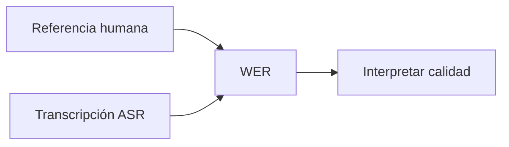

# L2 · Caso 00 — Medición WER
## Teoría ampliada del archivo

### La matemática que ejecuta el script

El archivo usa jiwer para calcular la distancia de edición entre referencia e hipótesis. La fórmula es:

```text
WER = (S + D + I) / N
```

Si la referencia tiene diez palabras y aparecen una sustitución y una omisión, el WER es 0.20. La métrica no dice cuál palabra importa más: solo cuenta diferencias.

### Lectura del código

<table>
<tr><th>Bloque</th><th>Responsabilidad</th></tr>
<tr><td>referencia</td><td>Ground truth humano.</td></tr>
<tr><td>transcripcion</td><td>Hipótesis producida por ASR.</td></tr>
<tr><td>wer</td><td>Compara ambas secuencias.</td></tr>
<tr><td>ChatOpenAI</td><td>Traduce la métrica a una explicación docente.</td></tr>
</table>

### Limitaciones

Antes de comparar, conviene normalizar mayúsculas, puntuación y espacios. Si no, una coma puede crear una diferencia que no representa un error de reconocimiento. También hay que revisar términos críticos aunque el WER sea bajo.

Leé la teoría general: [Teoría completa L2](TEORIA_L2_AUDIO_PIPELINES.md).


## Propósito

WER mide cuánto difiere una transcripción automática de una referencia humana. Es el primer paso para evaluar ASR con evidencia.



<table>
<tr><th>Sigla</th><th>Significado</th></tr>
<tr><td>S</td><td>Sustituciones: una palabra cambia por otra.</td></tr>
<tr><td>D</td><td>Deleciones: una palabra se pierde.</td></tr>
<tr><td>I</td><td>Inserciones: aparece una palabra extra.</td></tr>
<tr><td>N</td><td>Total de palabras de referencia.</td></tr>
</table>

Fórmula: WER = (S + D + I) / N.

## En el código

El script calcula WER con jiwer y luego usa LangChain para convertir ese número en una explicación comprensible.

## Experimento

Cambiá “comprimido” por “cápsula”. Después eliminá “ocho”. Compará cuál error produce mayor WER.

## Preguntas

- ¿WER indica qué palabra falló?
- ¿Un WER igual a cero garantiza que el audio original sea bueno?
- ¿Por qué necesitamos una referencia humana?
## Código y lectura ampliada

~~~python
from jiwer import wer

referencia = "tomar un comprimido cada ocho horas"
hipotesis = "tomar un comprimido cada dos horas"
error = wer(referencia, hipotesis)
print(error)
~~~

El script entrega una distancia global. Normalizá mayúsculas y puntuación antes de comparar para no medir diferencias superficiales.

### Segundo gráfico: lógica del archivo

~~~mermaid
flowchart LR
    A["Referencia"] --> B["Alinear palabras"] --> C["S, D e I"] --> D["WER"]
~~~

### Tabla de lectura rápida

| WER | Lectura | Acción |
|---:|---|---|
| 0 | Coincidencia. | Conservar evidencia. |
| Bajo | Pocos errores. | Buscar términos críticos. |
| Alto | Baja calidad. | Revisar audio y ASR. |

### Fórmula o regla relevante

~~~text
WER = (S + D + I) / N
La decisión final debe combinar métrica, contexto y política de riesgo.
~~~

