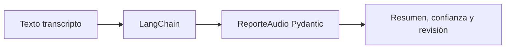

# L2 · Caso 01 — Indicación estructurada
## Teoría ampliada del archivo

### De lenguaje libre a contrato

El modelo puede responder un párrafo, pero un sistema posterior necesita campos predecibles. Con structured output, LangChain solicita una instancia compatible con ReporteAudio y Pydantic comprueba los tipos.

<table>
<tr><th>Pregunta</th><th>Respuesta del schema</th></tr>
<tr><td>¿Qué se dijo?</td><td>transcripción.</td></tr>
<tr><td>¿Qué significa en pocas palabras?</td><td>resumen.</td></tr>
<tr><td>¿Hay suficiente evidencia?</td><td>confianza y requiere revisión.</td></tr>
</table>

### Regla de seguridad

Un resumen nunca debe reemplazar el texto original. La transcripción queda como evidencia para que una persona pueda revisar la decisión.

### Lectura del código

1. Se carga la configuración.
2. Se declara ReporteAudio.
3. Se entrega una transcripción al extractor.
4. El resultado vuelve con tipos validados.
5. Se imprime model dump.

Leé la teoría general: [Teoría completa L2](TEORIA_L2_AUDIO_PIPELINES.md).

## Propósito

Una transcripción es texto. Un pipeline necesita un objeto claro para que otro sistema pueda usarlo sin adivinar campos.

<table>
<tr><th>Campo</th><th>Uso</th></tr>
<tr><td>transcripción</td><td>Conserva la evidencia original.</td></tr>
<tr><td>resumen</td><td>Explica la idea principal.</td></tr>
<tr><td>confianza</td><td>Declara grado de certeza.</td></tr>
<tr><td>requiere revisión</td><td>Evita automatizar sin evidencia.</td></tr>
</table>

## En el código

with structured output pide al modelo una respuesta compatible con ReporteAudio. Pydantic comprueba sus tipos.

## Experimento

Cambiá la frecuencia de la indicación y comprobá qué debe conservarse literal en la transcripción.

## Preguntas

- ¿Por qué resumen y transcripción no son lo mismo?
- ¿Qué dato no debería inventar nunca el agente?
## Código y lectura ampliada

~~~python
class ReporteAudio(BaseModel):
    transcripcion: str
    resumen: str
    requiere_revision: bool
    confianza: float = Field(ge=0, le=1)

reporte = extractor.with_structured_output(ReporteAudio).invoke(texto_audio)
~~~

El schema se define antes de invocar al modelo. Pydantic valida tipos y límites, pero no prueba que la transcripción sea verdadera.

### Segundo gráfico: lógica del archivo

~~~mermaid
flowchart LR
    A["Texto transcripto"] --> B["Prompt"] --> C["Schema Pydantic"] --> D["Backend"]
~~~

### Tabla de lectura rápida

| Campo | Control | Propósito |
|---|---|---|
| transcripcion | str | Conserva evidencia. |
| confianza | 0 a 1 | Expresa duda. |
| requiere_revision | bool | Activa control humano. |

### Fórmula o regla relevante

~~~text
WER = (S + D + I) / N
La decisión final debe combinar métrica, contexto y política de riesgo.
~~~

