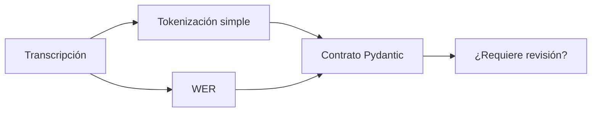

# L2 · Caso 02 — Pipeline seguro
## Teoría ampliada del archivo

### El gate de calidad

Este ejemplo no usa WER como decoración. Lo transforma en una regla de negocio:

```text
si WER > umbral, requiere revisión
si WER <= umbral, puede continuar
```

El umbral no es universal. En un recordatorio informal puede tolerarse más error que en una dosis, monto o cláusula.

<table>
<tr><th>Señal</th><th>Qué aporta</th><th>Qué no garantiza</th></tr>
<tr><td>Tokens estimados</td><td>Tamaño aproximado del texto.</td><td>Que tokenización real sea correcta.</td></tr>
<tr><td>WER</td><td>Error frente a referencia.</td><td>Que no exista un error crítico.</td></tr>
<tr><td>Pydantic</td><td>Forma válida de la salida.</td><td>Que el contenido sea verdadero.</td></tr>
</table>

### Punto pedagógico

El pipeline es una cadena: un error ASR se transmite al resumen. Por eso la calidad se evalúa antes de automatizar.

Leé la teoría general: [Teoría completa L2](TEORIA_L2_AUDIO_PIPELINES.md).


## Propósito

Este caso une una señal de calidad, una regla visible y una explicación. Enseña que una respuesta correcta no autoriza siempre a automatizar.



<table>
<tr><th>Dato</th><th>Qué explica</th></tr>
<tr><td>tokens estimados</td><td>Cuántas unidades procesa el texto.</td></tr>
<tr><td>WER</td><td>Diferencia contra una referencia.</td></tr>
<tr><td>resumen</td><td>Interpretación útil para una persona.</td></tr>
<tr><td>revisión</td><td>Freno de seguridad.</td></tr>
</table>

## Experimento

Introducí una palabra incorrecta en la transcripción. Observá cómo cambia WER y debatí el umbral prudente.

## Pregunta clave

¿Por qué cambiar el modelo de resumen no arregla una transcripción defectuosa?
## Código y lectura ampliada

~~~python
error_wer = wer(referencia, transcripcion)

resultado = PipelineAudio(
    tokens_estimados=len(transcripcion.split()),
    wer=error_wer,
    resumen="Resumen breve.",
    requiere_revision=error_wer > 0.10,
)
~~~

El umbral es una regla de negocio visible. No es una ley universal: debe ajustarse con golden cases y riesgo de dominio.

### Segundo gráfico: lógica del archivo

~~~mermaid
flowchart LR
    A["Audio"] --> B["ASR"] --> C["WER"] --> D["¿supera umbral?"]
~~~

### Tabla de lectura rápida

| Señal | Aporta | No garantiza |
|---|---|---|
| WER | Error contra referencia. | Que no haya un error crítico. |
| Pydantic | Forma correcta. | Contenido verdadero. |
| Tokens | Tamaño estimado. | Calidad de ASR. |

### Fórmula o regla relevante

~~~text
WER = (S + D + I) / N
La decisión final debe combinar métrica, contexto y política de riesgo.
~~~

