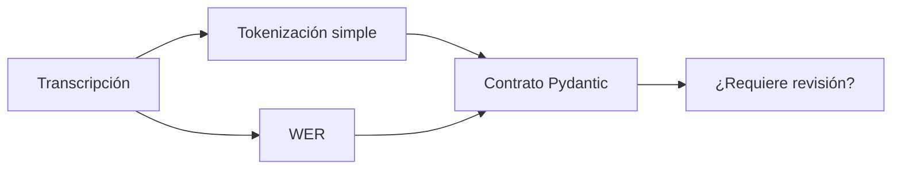
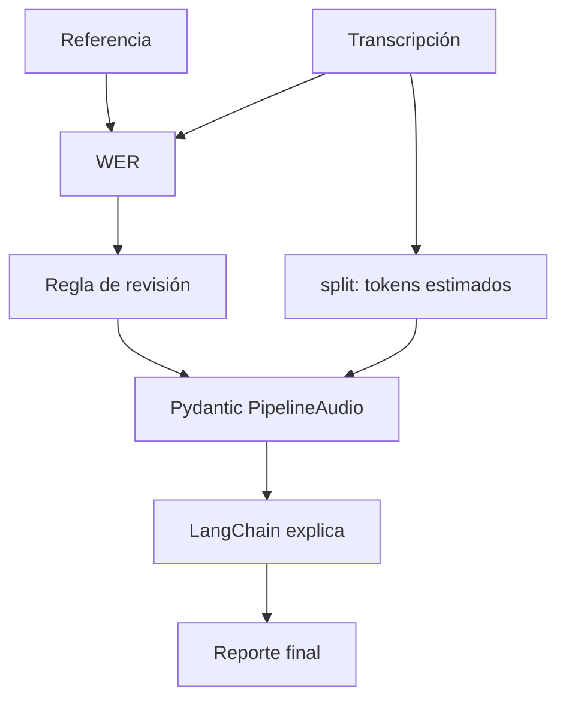

# L2 · Caso 02 — Pipeline seguro
## Teoría ampliada del archivo

### El gate de calidad

Este ejemplo no usa WER como decoración. Lo transforma en una regla de negocio:

```text
si WER > umbral, requiere revisión
si WER <= umbral, puede continuar
```

El umbral no es universal. En un recordatorio informal puede tolerarse más error que en una dosis, monto o cláusula.

<table>
<tr><th>Señal</th><th>Qué aporta</th><th>Qué no garantiza</th></tr>
<tr><td>Tokens estimados</td><td>Tamaño aproximado del texto.</td><td>Que tokenización real sea correcta.</td></tr>
<tr><td>WER</td><td>Error frente a referencia.</td><td>Que no exista un error crítico.</td></tr>
<tr><td>Pydantic</td><td>Forma válida de la salida.</td><td>Que el contenido sea verdadero.</td></tr>
</table>

### Punto pedagógico

El pipeline es una cadena: un error ASR se transmite al resumen. Por eso la calidad se evalúa antes de automatizar.

Leé la teoría general: [Teoría completa L2](TEORIA_L2_AUDIO_PIPELINES.md).


## Propósito

Este caso une una señal de calidad, una regla visible y una explicación. Enseña que una respuesta correcta no autoriza siempre a automatizar.



<table>
<tr><th>Dato</th><th>Qué explica</th></tr>
<tr><td>tokens estimados</td><td>Cuántas unidades procesa el texto.</td></tr>
<tr><td>WER</td><td>Diferencia contra una referencia.</td></tr>
<tr><td>resumen</td><td>Interpretación útil para una persona.</td></tr>
<tr><td>revisión</td><td>Freno de seguridad.</td></tr>
</table>

## Experimento

Introducí una palabra incorrecta en la transcripción. Observá cómo cambia WER y debatí el umbral prudente.

## Pregunta clave

¿Por qué cambiar el modelo de resumen no arregla una transcripción defectuosa?
## Código y lectura ampliada

~~~python
error_wer = wer(referencia, transcripcion)

resultado = PipelineAudio(
    tokens_estimados=len(transcripcion.split()),
    wer=error_wer,
    resumen="Resumen breve.",
    requiere_revision=error_wer > 0.10,
)
~~~

El umbral es una regla de negocio visible. No es una ley universal: debe ajustarse con golden cases y riesgo de dominio.

### Segundo gráfico: lógica del archivo

~~~mermaid
flowchart LR
    A["Audio"] --> B["ASR"] --> C["WER"] --> D["¿supera umbral?"]
~~~

### Tabla de lectura rápida

| Señal | Aporta | No garantiza |
|---|---|---|
| WER | Error contra referencia. | Que no haya un error crítico. |
| Pydantic | Forma correcta. | Contenido verdadero. |
| Tokens | Tamaño estimado. | Calidad de ASR. |

### Fórmula o regla relevante

~~~text
WER = (S + D + I) / N
La decisión final debe combinar métrica, contexto y política de riesgo.
~~~
## Explicación profunda del caso

Este archivo es el primer integrador: junta una métrica de calidad, una cuenta simple de tokens, un contrato Pydantic, una regla de negocio y una explicación LangChain. Está construido para mostrar que un pipeline no es una sola llamada al modelo.



### 1. Medir dos propiedades distintas

```python
tokens_estimados = len(transcripcion.split())
error_wer = wer(referencia, transcripcion)
```

`tokens_estimados` no es la tokenización real de un Transformer: cuenta palabras como aproximación docente. Sirve para hablar de tamaño de input. WER, en cambio, compara contenido con la referencia. No deben confundirse: una transcripción corta puede ser mala y una larga puede ser correcta.

### 2. Expresar reglas como un modelo tipado

```python
class PipelineAudio(BaseModel):
    tokens_estimados: int = Field(ge=1)
    wer: float = Field(ge=0)
    resumen: str
    requiere_revision: bool
```

El modelo impide que la cantidad de tokens sea cero o que WER sea negativo. No fija un límite superior porque WER puede ser superior a 1 cuando existen muchas inserciones.

### 3. Exponer la regla de riesgo

```python
requiere_revision=error_wer > 0.1
```

El umbral `0.1` fue elegido para discusión, no como norma médica universal. La fortaleza del código es que la regla está visible, es modificable y puede auditarse.

| Dato | Cómo se obtiene | Qué responde | No responde |
|---|---|---|---|
| Tokens estimados | Palabras separadas | Tamaño aproximado | Cómo tokeniza el modelo real. |
| WER | Referencia vs hipótesis | Error global | Severidad de cada palabra. |
| `requiere_revision` | Umbral explícito | Destino operativo | Verdad clínica. |
| Resumen | Texto diseñado | Lectura breve | Fidelidad por sí solo. |

### 4. Agregar explicación sin alterar el contrato

La llamada LangChain recibe `resultado.wer`, ya validado por Pydantic. Por eso la explicación queda fuera del modelo `PipelineAudio`: es información auxiliar y no debe reemplazar los campos controlados.

## Secuencia para enseñar

1. Cambiá `ocho` por `dos` en `transcripcion`.
2. Predecí el WER antes de ejecutar.
3. Observá que la regla puede marcar revisión.
4. Preguntá si el umbral detecta todo lo importante.
5. Proponé una lista adicional de términos críticos.

La conclusión es que automatizar responsablemente significa conservar evidencia técnica, formalizar reglas y dejar claro cuándo el flujo debe detenerse.
