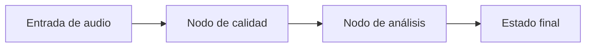

# L2 · Caso 03 — Flujo LangGraph de audio
## Teoría ampliada del archivo

### Qué agrega un grafo

Un grafo no hace al modelo más inteligente. Hace el proceso más observable. Cada nodo recibe un estado y devuelve solo las claves que agrega o modifica.

```text
estado inicial -> nodo 1 -> estado enriquecido -> nodo 2 -> resultado
```

<table>
<tr><th>Elemento</th><th>Función</th></tr>
<tr><td>TypedDict</td><td>Describe las claves posibles del estado.</td></tr>
<tr><td>Nodo</td><td>Ejecuta una transformación concreta.</td></tr>
<tr><td>Arista</td><td>Define el orden de los nodos.</td></tr>
<tr><td>compile</td><td>Convierte la definición en un flujo ejecutable.</td></tr>
</table>

### Cuándo usarlo

Usá LangGraph cuando necesites routing, reintentos, auditoría o varios pasos dependientes. Para una única llamada estructurada, LangChain directo suele ser más simple.

Leé la teoría general: [Teoría completa L2](TEORIA_L2_AUDIO_PIPELINES.md).


## Propósito

LangGraph hace visibles los pasos y el estado de un pipeline. Es útil cuando una decisión depende de varios resultados intermedios.



<table>
<tr><th>Concepto</th><th>Rol</th></tr>
<tr><td>Estado</td><td>Guarda datos que pasan de nodo a nodo.</td></tr>
<tr><td>Nodo</td><td>Transforma o agrega una parte del estado.</td></tr>
<tr><td>Arista</td><td>Define el orden del flujo.</td></tr>
<tr><td>Resultado</td><td>Permite auditar qué ocurrió.</td></tr>
</table>

## Experimento

Cambiá la entrada y seguí qué claves aparecen en el estado final.

## Preguntas

- ¿Qué dato debe quedar en el estado para poder depurar un error?
- ¿Cuándo bastaría LangChain sin usar un grafo?
## Código y lectura ampliada

~~~python
class EstadoAudio(TypedDict):
    wer: float
    destino: NotRequired[str]

def decidir_calidad(state: EstadoAudio) -> dict[str, str]:
    destino = "repetir_audio" if state["wer"] > 0.15 else "procesar"
    return {"destino": destino}
~~~

Cada nodo recibe estado y devuelve solo sus actualizaciones. Esto vuelve observable dónde cambió una decisión.

### Segundo gráfico: lógica del archivo

~~~mermaid
flowchart LR
    A["Estado inicial"] --> B["Nodo"] --> C["Estado enriquecido"] --> D["Resultado"]
~~~

### Tabla de lectura rápida

| Pieza | Rol |
|---|---|
| Estado | Datos compartidos. |
| Nodo | Una responsabilidad. |
| Arista | Orden de ejecución. |
| Compile | Flujo ejecutable. |

### Fórmula o regla relevante

~~~text
WER = (S + D + I) / N
La decisión final debe combinar métrica, contexto y política de riesgo.
~~~

