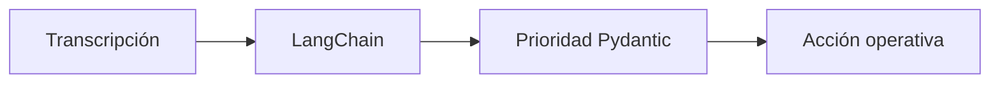
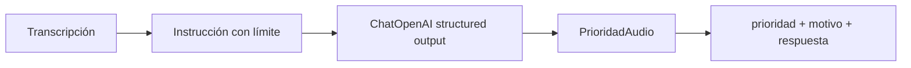

# L2 · Caso 04 — Clasificar prioridad de audio
## Teoría ampliada del archivo

### Clasificar no es diagnosticar

El archivo asigna prioridad operativa a una transcripción. No indica tratamiento ni reemplaza a una persona experta. La salida sirve para ordenar trabajo.

<table>
<tr><th>Prioridad</th><th>Ejemplo de acción</th></tr>
<tr><td>Baja</td><td>Registrar y responder por canal habitual.</td></tr>
<tr><td>Media</td><td>Derivar a una cola prioritaria.</td></tr>
<tr><td>Alta</td><td>Escalar para revisión humana inmediata.</td></tr>
</table>

### Diseño del prompt

El prompt debe delimitar el rol: clasificar evidencia disponible, no agregar información, no dar diagnóstico. El schema obliga a explicar el motivo de la prioridad.

### Evaluación

Para evaluar este agente se necesita un conjunto de transcripciones con prioridad esperada y una regla explícita para desacuerdos.

Leé la teoría general: [Teoría completa L2](TEORIA_L2_AUDIO_PIPELINES.md).


## Propósito

Una misma transcripción puede requerir acciones distintas. Este caso enseña a separar clasificación operativa de diagnóstico o respuesta médica.



<table>
<tr><th>Campo</th><th>Pregunta que responde</th></tr>
<tr><td>prioridad</td><td>¿Cuán rápido debe atenderse?</td></tr>
<tr><td>motivo</td><td>¿Qué evidencia justifica la prioridad?</td></tr>
<tr><td>respuesta operativa</td><td>¿Cuál es el siguiente paso?</td></tr>
</table>

## Límite pedagógico

Clasificar prioridad no reemplaza a un profesional ni genera diagnóstico. El agente organiza una derivación.

## Experimento

Probá una transcripción de soporte, otra de reunión y otra con una alerta. Compará el motivo y la respuesta operativa.
## Código y lectura ampliada

~~~python
class PrioridadAudio(BaseModel):
    prioridad: str
    motivo: str
    respuesta_operativa: str

resultado = extractor.invoke("Clasificá sin diagnosticar: " + transcripcion)
~~~

La prioridad organiza trabajo; no genera diagnóstico ni reemplaza una persona experta. El motivo permite revisar la clasificación.

### Segundo gráfico: lógica del archivo

~~~mermaid
flowchart LR
    A["Transcripción"] --> B["Agente"] --> C["Prioridad"] --> D["Acción operativa"]
~~~

### Tabla de lectura rápida

| Prioridad | Ejemplo de ruta |
|---|---|
| Baja | Registrar y atender. |
| Media | Cola prioritaria. |
| Alta | Escalamiento humano. |

### Fórmula o regla relevante

~~~text
WER = (S + D + I) / N
La decisión final debe combinar métrica, contexto y política de riesgo.
~~~
## Explicación profunda del caso

Este caso concentra LangChain y Pydantic en una clasificación operativa. No es un clasificador médico: usa una transcripción de ejemplo para decidir la prioridad de atención sin emitir diagnóstico.



### 1. El schema define qué significa “clasificar”

```python
class PrioridadAudio(BaseModel):
    prioridad: str
    motivo: str
    respuesta_operativa: str
```

Sin schema, el modelo podría devolver un párrafo, una lista o texto irrelevante. Aquí debe expresar prioridad, explicación y una acción. A propósito los campos son simples: el ejercicio busca hacer visible el contrato antes de introducir `Literal` o validadores complejos.

### 2. La instrucción delimita el alcance

```python
"Clasificá ... como baja, media o alta prioridad. No des diagnóstico médico: "
```

La prohibición es tan importante como la tarea. El LLM procesa lenguaje y puede redactar contenido convincente; el prompt restringe una salida operacional y evita que se presente como profesional de salud.

### 3. Structured output transforma texto en datos

```python
extractor = ChatOpenAI(...).with_structured_output(PrioridadAudio)
resultado = extractor.invoke(...)
```

LangChain prepara el pedido y Pydantic verifica que se puedan construir los tres campos. `model_dump()` permite imprimir un diccionario para inspección o envío a otro sistema.

| Campo | Decisión que representa | Evidencia que debería acompañarlo |
|---|---|---|
| `prioridad` | Orden de atención | Texto fuente y regla de clasificación. |
| `motivo` | Por qué se eligió esa prioridad | Fragmento de transcripción. |
| `respuesta_operativa` | Próximo paso | Política del proceso, no diagnóstico. |

## Pregunta crítica

La clasificación no puede reparar un ASR equivocado. Antes de invocar este archivo, un pipeline serio debería conocer WER, verificar palabras críticas y guardar el audio. El caso muestra posproceso; no reemplaza las etapas de calidad.
