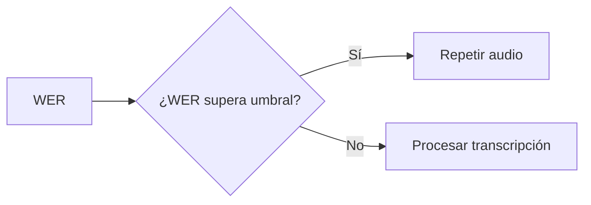

# L2 · Caso 05 — Routing por calidad
## Teoría ampliada del archivo

### Routing determinista

El nodo toma WER y aplica una regla:

```text
destino = repetir audio si WER > 0.15
destino = procesar transcripción si WER <= 0.15
```

La ventaja es que el criterio queda visible, probado y fácil de cambiar.

<table>
<tr><th>Error de decisión</th><th>Consecuencia</th></tr>
<tr><td>Falso positivo</td><td>Se pide repetir un audio que podía procesarse.</td></tr>
<tr><td>Falso negativo</td><td>Se automatiza un audio poco confiable.</td></tr>
</table>

### Cómo elegir el umbral

No se elige “porque parece razonable”. Se evalúa con golden cases. En un dominio crítico se prefiere más revisión para reducir falsos negativos peligrosos.

Leé la teoría general: [Teoría completa L2](TEORIA_L2_AUDIO_PIPELINES.md).


## Propósito

El routing convierte una métrica en una ruta explícita del sistema. Es un patrón básico de automatización responsable.



<table>
<tr><th>Ruta</th><th>Cuándo se usa</th></tr>
<tr><td>procesar transcripción</td><td>El WER está dentro del umbral definido.</td></tr>
<tr><td>repetir audio</td><td>La señal indica calidad insuficiente.</td></tr>
</table>

## Experimento

Probá WER de 0.05, 0.15 y 0.21. Después cambiá el umbral y debatí qué riesgo aceptás.

## Pregunta

¿Por qué un umbral fijo debe validarse con casos reales del dominio?
## Código y lectura ampliada

~~~python
def decidir_calidad(state: EstadoAudio) -> dict[str, str]:
    if state["wer"] > 0.15:
        return {"destino": "repetir_audio"}
    return {"destino": "procesar_transcripcion"}
~~~

La regla es determinista: el mismo WER obtiene el mismo destino. El LLM puede explicar la decisión, pero la política debe ser comprobable.

### Segundo gráfico: lógica del archivo

~~~mermaid
flowchart LR
    A["WER"] --> B["¿mayor a 0.15?"] --> C["Procesar o repetir"] --> D["Resultado"]
~~~

### Tabla de lectura rápida

| WER | Destino |
|---:|---|
| 0.05 | Procesar. |
| 0.15 | Procesar. |
| 0.16 | Repetir audio. |
| 0.30 | Revisión prioritaria. |

### Fórmula o regla relevante

~~~text
WER = (S + D + I) / N
La decisión final debe combinar métrica, contexto y política de riesgo.
~~~

