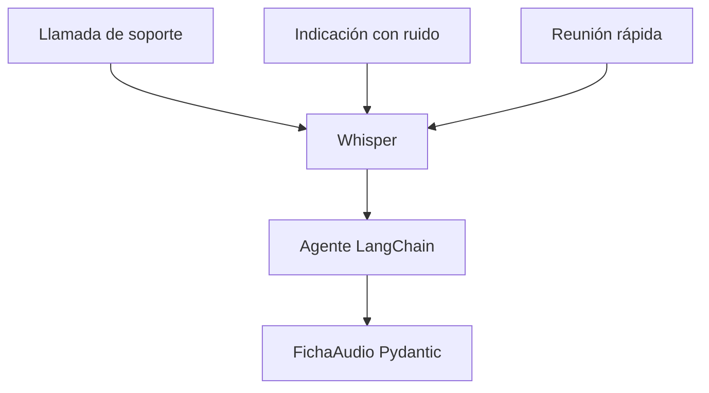

# L2 · Caso 06 — Agente para varios audios
## Teoría ampliada del archivo

### Separar ASR de interpretación

Whisper responde qué palabras detecta. El agente LangChain decide qué tipo de audio parece ser y qué acción operativa conviene. Separar ambas tareas permite saber dónde aparece un error.

<table>
<tr><th>Entrada</th><th>ASR produce</th><th>Agente produce</th></tr>
<tr><td>WAV</td><td>Transcripción.</td><td>Tipo, calidad, acción y motivo.</td></tr>
</table>

### Por qué hay variantes

Ruido, velocidad, pausas y cortes cambian la señal aunque el contenido sea el mismo. Esto simula el mundo real y evita diseñar para un único audio limpio.

### Ejercicio de diagnóstico

Si la acción parece incorrecta, revisar en este orden: archivo, transcripción, WER y prompt del agente. No asumir que el LLM es la causa.

Leé la teoría general: [Teoría completa L2](TEORIA_L2_AUDIO_PIPELINES.md).

## Propósito

El agente aplica el mismo contrato a distintos tipos y condiciones de audio: soporte, indicación y reunión.

<table>
<tr><th>Campo</th><th>Uso</th></tr>
<tr><td>tipo de audio</td><td>Clasifica contexto.</td></tr>
<tr><td>transcripción</td><td>Conserva evidencia ASR.</td></tr>
<tr><td>calidad estimada</td><td>Hace visible incertidumbre.</td></tr>
<tr><td>acción</td><td>Define automatizar, revisar o pedir nuevo audio.</td></tr>
</table>

## Experimento

Reemplazá un archivo por su variante entrecortada. Compará la transcripción y la acción.

## Preguntas

- ¿Por qué un solo schema puede atender tipos de audio diferentes?
- ¿Qué parte es responsabilidad de Whisper y cuál de LangChain?
## Código y lectura ampliada

~~~python
with ruta_audio.open("rb") as archivo:
    respuesta = cliente_audio.audio.transcriptions.create(
        model="whisper-1", file=archivo, language="es"
    )

ficha = agente.invoke({"messages": [{"role": "user", "content": respuesta.text}]})
~~~

Whisper responde qué se escuchó. LangChain interpreta ese texto. Separar responsabilidades evita atribuir al LLM un error que proviene del audio.

### Segundo gráfico: lógica del archivo

~~~mermaid
flowchart LR
    A["Soporte, reunión e indicación"] --> B["Whisper"] --> C["Transcripción"] --> D["Mismo agente"]
~~~

### Tabla de lectura rápida

| Entrada | ASR devuelve | Agente devuelve |
|---|---|---|
| WAV | Texto. | Tipo, calidad y acción. |
| Variante ruidosa | Texto degradado. | Revisión o pedido de audio. |

### Fórmula o regla relevante

~~~text
WER = (S + D + I) / N
La decisión final debe combinar métrica, contexto y política de riesgo.
~~~

