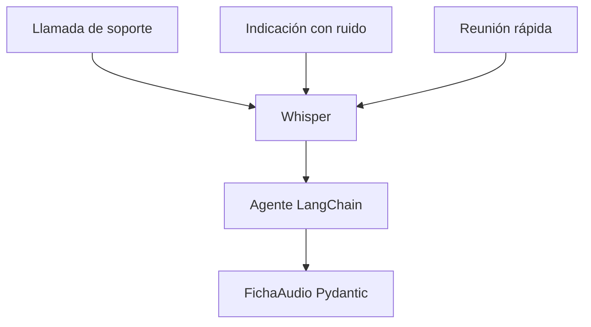
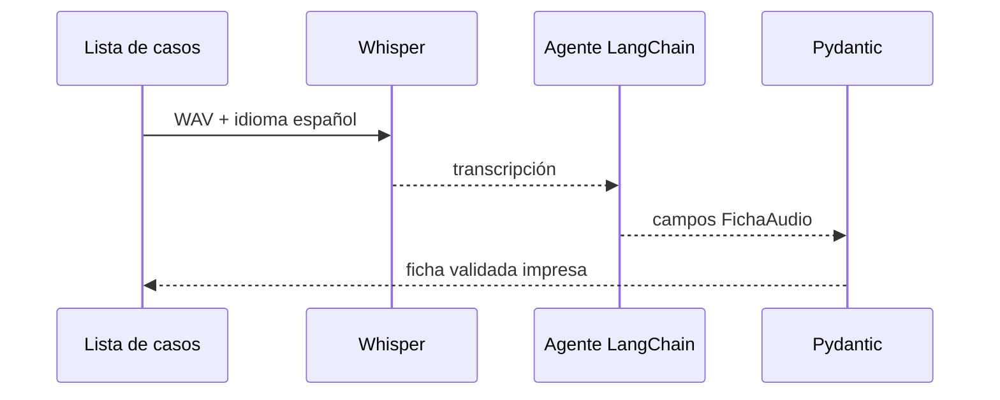

# L2 · Caso 06 — Agente para varios audios
## Teoría ampliada del archivo

### Separar ASR de interpretación

Whisper responde qué palabras detecta. El agente LangChain decide qué tipo de audio parece ser y qué acción operativa conviene. Separar ambas tareas permite saber dónde aparece un error.

<table>
<tr><th>Entrada</th><th>ASR produce</th><th>Agente produce</th></tr>
<tr><td>WAV</td><td>Transcripción.</td><td>Tipo, calidad, acción y motivo.</td></tr>
</table>

### Por qué hay variantes

Ruido, velocidad, pausas y cortes cambian la señal aunque el contenido sea el mismo. Esto simula el mundo real y evita diseñar para un único audio limpio.

### Ejercicio de diagnóstico

Si la acción parece incorrecta, revisar en este orden: archivo, transcripción, WER y prompt del agente. No asumir que el LLM es la causa.

Leé la teoría general: [Teoría completa L2](TEORIA_L2_AUDIO_PIPELINES.md).


## Propósito

El agente aplica el mismo contrato a distintos tipos y condiciones de audio: soporte, indicación y reunión.



<table>
<tr><th>Campo</th><th>Uso</th></tr>
<tr><td>tipo de audio</td><td>Clasifica contexto.</td></tr>
<tr><td>transcripción</td><td>Conserva evidencia ASR.</td></tr>
<tr><td>calidad estimada</td><td>Hace visible incertidumbre.</td></tr>
<tr><td>acción</td><td>Define automatizar, revisar o pedir nuevo audio.</td></tr>
</table>

## Experimento

Reemplazá un archivo por su variante entrecortada. Compará la transcripción y la acción.

## Preguntas

- ¿Por qué un solo schema puede atender tipos de audio diferentes?
- ¿Qué parte es responsabilidad de Whisper y cuál de LangChain?
## Código y lectura ampliada

~~~python
with ruta_audio.open("rb") as archivo:
    respuesta = cliente_audio.audio.transcriptions.create(
        model="whisper-1", file=archivo, language="es"
    )

ficha = agente.invoke({"messages": [{"role": "user", "content": respuesta.text}]})
~~~

Whisper responde qué se escuchó. LangChain interpreta ese texto. Separar responsabilidades evita atribuir al LLM un error que proviene del audio.

### Segundo gráfico: lógica del archivo

~~~mermaid
flowchart LR
    A["Soporte, reunión e indicación"] --> B["Whisper"] --> C["Transcripción"] --> D["Mismo agente"]
~~~

### Tabla de lectura rápida

| Entrada | ASR devuelve | Agente devuelve |
|---|---|---|
| WAV | Texto. | Tipo, calidad y acción. |
| Variante ruidosa | Texto degradado. | Revisión o pedido de audio. |

### Fórmula o regla relevante

~~~text
WER = (S + D + I) / N
La decisión final debe combinar métrica, contexto y política de riesgo.
~~~
## Explicación profunda del caso

Este es el primer caso con **tres audios reales**. El objetivo no es solo transcribir: compara una llamada normal, una indicación con ruido y una reunión acelerada. Así se muestra que la decisión posterior debe depender de la evidencia de cada archivo, no de un único ejemplo “ideal”.


### 1. El contrato de salida sirve para comparar casos heterogéneos

```python
class FichaAudio(BaseModel):
    archivo: str = ""
    tipo_audio: str
    transcripcion: str = Field(min_length=1)
    calidad_estimada: str
    accion: str
    motivo: str
```

Los tres WAV pueden tener contenido distinto, pero todos producen la misma ficha. `Field(min_length=1)` impide tratar una transcripción vacía como un caso válido. El campo `archivo` se completa después porque el agente recibe el nombre dentro del prompt, pero se lo vuelve a fijar desde el código para conservar trazabilidad.

| Campo | De dónde sale | Para qué se conserva |
|---|---|---|
| `archivo` | Lista local, no LLM | Vincular la decisión con el WAV original. |
| `transcripcion` | Whisper | Evidencia textual que recibió el agente. |
| `tipo_audio` | Agente basado en texto | Clasificar contexto: soporte, reunión o indicación. |
| `calidad_estimada` | Agente y contexto disponible | Señal orientativa, no reemplaza WER. |
| `accion` / `motivo` | Agente | Indicar siguiente paso y explicación. |

### 2. La lista de casos es un mini benchmark

```python
casos = [
    ("llamada_soporte.wav", "llamada de soporte normal"),
    ("indicacion_medica_ruido.wav", "indicación médica con ruido"),
    ("reunion_equipo_rapido.wav", "reunión de equipo acelerada"),
]
```

Cada tupla combina identificador del recurso y contexto docente. El nombre del archivo permite abrir bytes; la descripción ayuda a discutir por qué las condiciones esperadas son distintas. No es una etiqueta de verdad que el modelo deba repetir sin mirar el texto.

### 3. Whisper es la frontera audio → texto

```python
with ruta_audio.open("rb") as archivo_audio:
    respuesta_asr = cliente_audio.audio.transcriptions.create(
        model="whisper-1", file=archivo_audio, language="es"
    )
```

El bucle abre un archivo por vez, lo transcribe y guarda `respuesta_asr.text`. `language="es"` da el idioma esperado. Este bloque no determina intención ni calidad; solo produce la hipótesis que se entregará al agente.

### 4. El agente interpreta una transcripción, no el WAV

```python
agente = create_agent(
    model="openai:gpt-4o-mini",
    tools=[],
    response_format=FichaAudio,
    system_prompt="... Usá solo la transcripción entregada ...",
)
```

`tools=[]` hace visible que este agente no consulta bases externas ni modifica sistemas. `response_format=FichaAudio` acota la forma de salida. La restricción “usá solo la transcripción” evita presentar una deducción como si hubiese escuchado el audio.

### 5. Validar y mostrar cada caso

`agente.invoke(...)` devuelve un estado de agente; `structured_response` contiene el objeto tipado. `FichaAudio.model_validate(...)` vuelve a verificarlo e incorpora el `archivo` controlado por Python. Cada `print` genera una ficha independiente para comparar.



## Límites y extensión correcta

La “calidad estimada” del agente es solo un análisis del texto y del contexto. Para evaluarla realmente habría que agregar WER contra una referencia por audio, como hacen los casos 10 y 11. La extensión natural es incluir `wer`, términos críticos y una regla determinista antes de aceptar `accion="automatizar"`.
