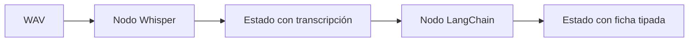
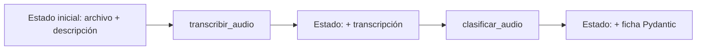

# L2 · Caso 07 — Varios audios con LangGraph
## Teoría ampliada del archivo

### Estado trazable

Este archivo convierte el caso multi audio en dos nodos. El primer nodo agrega transcripción; el segundo agrega ficha. Esto permite inspeccionar cada estado intermedio.

<table>
<tr><th>Estado</th><th>Valor pedagógico</th></tr>
<tr><td>Antes de ASR</td><td>Muestra archivo y descripción del caso.</td></tr>
<tr><td>Después de ASR</td><td>Permite revisar el texto exacto antes de clasificar.</td></tr>
<tr><td>Después del agente</td><td>Muestra una decisión Pydantic uniforme.</td></tr>
</table>

### Ventaja de reintentos

Si falla la clasificación pero la transcripción es buena, el sistema puede reintentar solo el segundo nodo. Reprocesar audio sería costo y latencia innecesarios.

Leé la teoría general: [Teoría completa L2](TEORIA_L2_AUDIO_PIPELINES.md).


## Propósito

Este caso representa el mismo problema del agente múltiple, pero deja visible la separación entre transcripción y clasificación.



<table>
<tr><th>Herramienta</th><th>Responsabilidad</th></tr>
<tr><td>Whisper</td><td>Convierte audio en texto.</td></tr>
<tr><td>LangChain</td><td>Interpreta el texto.</td></tr>
<tr><td>LangGraph</td><td>Conserva orden y estado de pasos.</td></tr>
<tr><td>Pydantic</td><td>Valida la ficha final.</td></tr>
</table>

## Experimento

Cambiá el caso por una variante con pausas. Seguí la transcripción en el estado antes de mirar la decisión.

## Pregunta clave

¿Qué ventaja tendría reintentar solo el nodo de clasificación sin volver a transcribir?
## Código y lectura ampliada

~~~python
grafo.add_node("transcribir_audio", transcribir_audio)
grafo.add_node("clasificar_audio", clasificar_audio)
grafo.add_edge(START, "transcribir_audio")
grafo.add_edge("transcribir_audio", "clasificar_audio")
grafo.add_edge("clasificar_audio", END)
~~~

La transcripción queda en el estado antes de clasificar. Si el segundo nodo falla, se puede reintentar sin volver a pagar ni demorar ASR.

### Segundo gráfico: lógica del archivo

~~~mermaid
flowchart LR
    A["WAV"] --> B["Nodo ASR"] --> C["Estado con texto"] --> D["Nodo LangChain"]
~~~

### Tabla de lectura rápida

| Falla | Primer lugar para revisar |
|---|---|
| Sin texto | Archivo y ASR. |
| Texto errado | Ruido, idioma y WER. |
| Ficha errada | Prompt, schema y texto. |

### Fórmula o regla relevante

~~~text
WER = (S + D + I) / N
La decisión final debe combinar métrica, contexto y política de riesgo.
~~~
## Explicación profunda del caso

Este archivo usa los mismos tres escenarios del caso 06, pero muestra el handoff como un grafo. La diferencia importante no es “usar otra librería”: cada nodo tiene una responsabilidad y el estado deja evidencia de lo que sucedió entre pasos.



### 1. Estado evolutivo del flujo

```python
class EstadoAudio(TypedDict):
    archivo: str
    descripcion: str
    transcripcion: NotRequired[str]
    ficha: NotRequired[dict[str, object]]
```

`archivo` y `descripcion` son obligatorios al inicio. `transcripcion` aparece después del primer nodo; `ficha`, después del segundo. Esta forma permite inspeccionar el resultado final y entender qué nodo agregó cada campo.

### 2. Tipos de actualización reducen ambigüedad

```python
class ActualizacionTranscripcion(TypedDict):
    transcripcion: str

class ActualizacionFicha(TypedDict):
    ficha: dict[str, object]
```

Los nodos no deberían devolver estados completos copiados. Devuelven solo la actualización que producen. Esto hace más fácil detectar si un nodo inesperadamente cambia un dato de entrada.

### 3. Nodo de ASR

```python
def transcribir_audio(state: EstadoAudio) -> ActualizacionTranscripcion:
    ruta_audio = carpeta_datos / state["archivo"]
    ...
    return {"transcripcion": str(respuesta_asr.text)}
```

Recibe solo el estado, resuelve la ruta, abre bytes y devuelve texto. No sabe cómo clasificar calidad ni decide la acción. Es una separación de responsabilidades deliberada.

### 4. Nodo de interpretación estructurada

`clasificar_audio` toma `archivo`, `descripcion` y `transcripcion`. Con `with_structured_output(FichaAudio)` produce un objeto validable. El texto se obtiene mediante `state.get('transcripcion', '')`: es una defensa de lectura, aunque por la secuencia del grafo el campo debería existir.

| Nodo | Lee del estado | Agrega | No debería hacer |
|---|---|---|---|
| `transcribir_audio` | `archivo` | `transcripcion` | Clasificar, resumir o decidir negocio. |
| `clasificar_audio` | Archivo, descripción, transcripción | `ficha` | Volver a enviar audio a ASR. |

### 5. Conexiones y ejecución repetida

```python
grafo.add_edge(START, "transcribir_audio")
grafo.add_edge("transcribir_audio", "clasificar_audio")
grafo.add_edge("clasificar_audio", END)
```

La cadena de aristas define el orden. `aplicacion = grafo.compile()` valida y prepara el grafo; `aplicacion.invoke(entrada)` lo ejecuta una vez por caso. `cast(EstadoAudio, ...)` sirve al analizador de tipos para declarar el estado esperado al final.

## Qué mirar en clase

1. Mostrá el estado inicial: aún no hay texto ni ficha.
2. Explicá que el primer nodo agrega transcripción real.
3. Mostrá que el segundo nodo recibe exactamente esa transcripción.
4. Compará la ficha de los tres escenarios.
5. Preguntá qué nodo sumarías para calcular WER antes de clasificar.

El caso 11 responde esa última pregunta y agrega una métrica objetiva entre ASR y la decisión.
