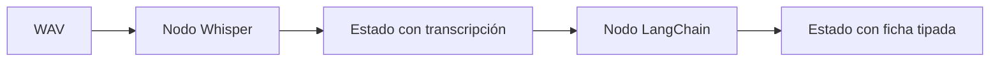

# L2 · Caso 07 — Varios audios con LangGraph
## Teoría ampliada del archivo

### Estado trazable

Este archivo convierte el caso multi audio en dos nodos. El primer nodo agrega transcripción; el segundo agrega ficha. Esto permite inspeccionar cada estado intermedio.

<table>
<tr><th>Estado</th><th>Valor pedagógico</th></tr>
<tr><td>Antes de ASR</td><td>Muestra archivo y descripción del caso.</td></tr>
<tr><td>Después de ASR</td><td>Permite revisar el texto exacto antes de clasificar.</td></tr>
<tr><td>Después del agente</td><td>Muestra una decisión Pydantic uniforme.</td></tr>
</table>

### Ventaja de reintentos

Si falla la clasificación pero la transcripción es buena, el sistema puede reintentar solo el segundo nodo. Reprocesar audio sería costo y latencia innecesarios.

Leé la teoría general: [Teoría completa L2](TEORIA_L2_AUDIO_PIPELINES.md).

## Propósito

Este caso representa el mismo problema del agente múltiple, pero deja visible la separación entre transcripción y clasificación.

<table>
<tr><th>Herramienta</th><th>Responsabilidad</th></tr>
<tr><td>Whisper</td><td>Convierte audio en texto.</td></tr>
<tr><td>LangChain</td><td>Interpreta el texto.</td></tr>
<tr><td>LangGraph</td><td>Conserva orden y estado de pasos.</td></tr>
<tr><td>Pydantic</td><td>Valida la ficha final.</td></tr>
</table>

## Experimento

Cambiá el caso por una variante con pausas. Seguí la transcripción en el estado antes de mirar la decisión.

## Pregunta clave

¿Qué ventaja tendría reintentar solo el nodo de clasificación sin volver a transcribir?
## Código y lectura ampliada

~~~python
grafo.add_node("transcribir_audio", transcribir_audio)
grafo.add_node("clasificar_audio", clasificar_audio)
grafo.add_edge(START, "transcribir_audio")
grafo.add_edge("transcribir_audio", "clasificar_audio")
grafo.add_edge("clasificar_audio", END)
~~~

La transcripción queda en el estado antes de clasificar. Si el segundo nodo falla, se puede reintentar sin volver a pagar ni demorar ASR.

### Segundo gráfico: lógica del archivo

~~~mermaid
flowchart LR
    A["WAV"] --> B["Nodo ASR"] --> C["Estado con texto"] --> D["Nodo LangChain"]
~~~

### Tabla de lectura rápida

| Falla | Primer lugar para revisar |
|---|---|
| Sin texto | Archivo y ASR. |
| Texto errado | Ruido, idioma y WER. |
| Ficha errada | Prompt, schema y texto. |

### Fórmula o regla relevante

~~~text
WER = (S + D + I) / N
La decisión final debe combinar métrica, contexto y política de riesgo.
~~~

