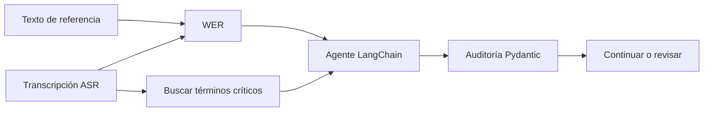
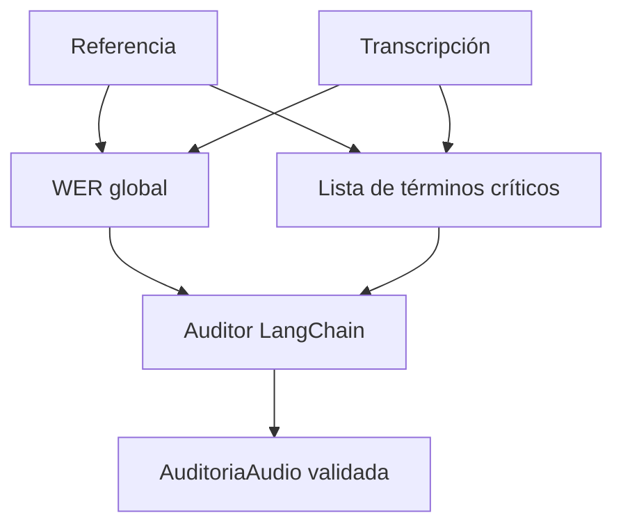

# L2 · Caso 08 — Auditor de errores críticos
## Teoría ampliada del archivo

### WER global frente a riesgo semántico

El ejemplo tiene una sola sustitución. Matemáticamente:

```text
WER = 1 error / 9 palabras aproximadamente = 0.111
```

Pero el cambio de frecuencia modifica el significado del mensaje. Por eso se agregan términos críticos.

<table>
<tr><th>Señal</th><th>Respuesta</th></tr>
<tr><td>WER bajo y término crítico intacto</td><td>Puede continuar según política.</td></tr>
<tr><td>WER bajo y término crítico afectado</td><td>Revisión humana.</td></tr>
<tr><td>WER alto</td><td>Revisar o pedir nuevo audio.</td></tr>
</table>

### Diseño reutilizable

El patrón sirve para salud, finanzas, legal y soporte. Solo cambia la lista de términos sensibles y la política de escalamiento.

Leé la teoría general: [Teoría completa L2](TEORIA_L2_AUDIO_PIPELINES.md).


## Qué aprendés

Este caso enseña que **WER no alcanza por sí solo**. Una transcripción puede tener pocos errores totales y aun así cambiar un dato peligroso.

El ejemplo compara:

- Referencia: “tomar un comprimido cada **ocho** horas”.
- Transcripción: “tomar un comprimido cada **dos** horas”.

Solo hay una sustitución, pero modifica la frecuencia. Por ese motivo, el pipeline debe detenerse y pedir revisión.

## Idea clave

> La métrica mide cantidad de errores; el dominio determina su gravedad.

## Flujo del ejemplo



## Conceptos

<table>
<tr><th>Concepto</th><th>Explicación</th><th>Uso en el archivo</th></tr>
<tr><td>Referencia</td><td>Texto humano considerado correcto.</td><td>Permite evaluar ASR.</td></tr>
<tr><td>Hipótesis</td><td>Texto devuelto por la transcripción automática.</td><td>Se compara con la referencia.</td></tr>
<tr><td>WER</td><td>Errores de palabra sobre palabras de referencia.</td><td>Entrega una señal numérica.</td></tr>
<tr><td>Término crítico</td><td>Palabra o frase cuyo cambio altera una decisión.</td><td>Frecuencias, montos, fechas o negaciones.</td></tr>
<tr><td>Pydantic</td><td>Contrato de salida de la auditoría.</td><td>Evita una respuesta libre ambigua.</td></tr>
</table>

## Qué hace el agente

El agente recibe la referencia, la transcripción, el WER y los términos críticos ausentes. Devuelve:

```text
wer
terminos_criticos_afectados
nivel_riesgo
accion
motivo
```

No diagnostica ni modifica una indicación. Solo decide si el texto transcripto es confiable para seguir.

## Cómo ejecutar

```powershell
.\.venv\Scripts\python.exe .\03_extras\L2_audio_y_pipelines\resumen\08_auditor_errores_criticos_langchain.py
```

Requiere OPENAI API KEY en el archivo .env.

## Experimento guiado

1. Ejecutá el archivo sin cambios.
2. Cambiá “dos horas” por “ocho horas”.
3. Ejecutalo otra vez.
4. Compará WER, términos afectados y acción.
5. Cambiá “comprimido” por “cápsula”. Debatí si el nivel de riesgo debería ser igual.

## Preguntas para discutir

- ¿Puede WER ser bajo y el riesgo ser alto?
- ¿Qué términos serían críticos en una transferencia bancaria?
- ¿Qué es peor: omitir un dato crítico o inventarlo?
- ¿Quién debería revisar el caso escalado?

## Extensión

Convertí los términos críticos en una lista por dominio:

- Salud: dosis, frecuencia, duración.
- Finanzas: monto, cuenta, moneda.
- Legal: fecha, cláusula, vigencia.
- Soporte: número de ticket, producto, prioridad.
## Código y lectura ampliada

~~~python
terminos_criticos = ["ocho horas", "cinco días", "comprimido"]
afectados = [t for t in terminos_criticos if t not in transcripcion.lower()]
error = wer(referencia.lower(), transcripcion.lower())
~~~

La lista es una política del dominio. WER bajo con una frecuencia alterada no permite automatizar.

### Segundo gráfico: lógica del archivo

~~~mermaid
flowchart LR
    A["Transcripción"] --> B["WER y términos críticos"] --> C["Doble gate"] --> D["Decisión"]
~~~

### Tabla de lectura rápida

| Escenario | WER | Término crítico | Acción |
|---|---:|---|---|
| Claro | Bajo | Intacto | Continuar. |
| Dosis alterada | Bajo | Afectado | Revisar. |
| Degradado | Alto | Incierto | Pedir audio. |

### Fórmula o regla relevante

~~~text
WER = (S + D + I) / N
La decisión final debe combinar métrica, contexto y política de riesgo.
~~~
## Explicación profunda del caso

Este caso ataca el límite más importante de WER: todos los errores cuentan igual, pero no todos tienen el mismo impacto. Cambiar “ocho horas” por “dos horas” genera una sola diferencia de palabras y puede ser una situación grave.



### 1. Un schema con decisiones acotadas

```python
class AuditoriaAudio(BaseModel):
    wer: float = Field(ge=0)
    terminos_criticos_afectados: list[str]
    nivel_riesgo: Literal["bajo", "medio", "alto"]
    accion: Literal["continuar", "revisar_transcripcion", "pedir_audio_nuevo"]
    motivo: str = Field(min_length=15)
```

`Literal` reduce respuestas vagas: el modelo debe escoger categorías permitidas. `motivo` exige una explicación de al menos 15 caracteres para que no se limite a “hay riesgo”. El modelo de datos convierte una conversación libre en una salida operacional.

### 2. Definir explícitamente aquello que no puede fallar

```python
terminos_criticos = ["ocho horas", "cinco días", "comprimido"]
afectados = [termino for termino in terminos_criticos if termino not in transcripcion.lower()]
```

La lista es una regla de dominio, no una predicción automática. Busca cada término esperado dentro de la hipótesis. Es una versión muy simple que enseña la idea; una producción debería normalizar variantes, entidades numéricas y contexto para evitar falsos positivos.

### 3. Medir primero, razonar después

```python
error_wer = round(wer(referencia.lower(), transcripcion.lower()), 3)
```

Las dos cadenas se pasan a minúsculas para ignorar estilo. El número queda calculado por JiWER antes de invocar el LLM. Después el prompt entrega referencia, hipótesis, WER y términos faltantes para que el auditor justifique una decisión basada en evidencia.

| Evidencia | Cómo se calcula | Aporte |
|---|---|---|
| WER | Distancia de palabras | Calidad global. |
| `afectados` | Lista de términos ausentes | Riesgo específico de dominio. |
| Referencia + hipótesis | Texto completo | Contexto para explicar. |
| Schema | Pydantic | Forma consistente de decisión. |

### 4. El auditor tiene una prohibición clara

El prompt dice “No des consejos médicos” y “Si cambia una frecuencia, elegí revisión”. El modelo no debe modificar la indicación ni elegir tratamiento: su rol es detener la automatización si la fuente es insegura.

### 5. Validación final

`AuditoriaAudio.model_validate(resultado)` hace explícito que ningún objeto se imprime o reenvía sin pasar por el contrato. Si el modelo devuelve una acción no permitida, el error se ve inmediatamente en lugar de propagarse.

## Debate docente

| Situación | WER posible | Acción prudente |
|---|---:|---|
| Falta una coma | Bajo o cero | Revisar regla de normalización. |
| `ocho` por `dos` | Bajo | Revisar transcripción, riesgo alto. |
| Audio incomprensible completo | Alto | Pedir nuevo audio. |
| Palabra no crítica equivocada | Bajo | Depende de política y contexto. |

La combinación “métrica + términos críticos + schema” es más fuerte que cualquiera de las tres piezas aisladas.
