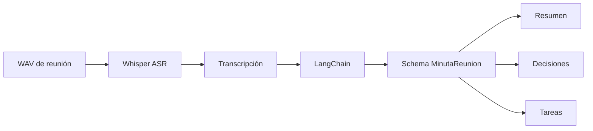
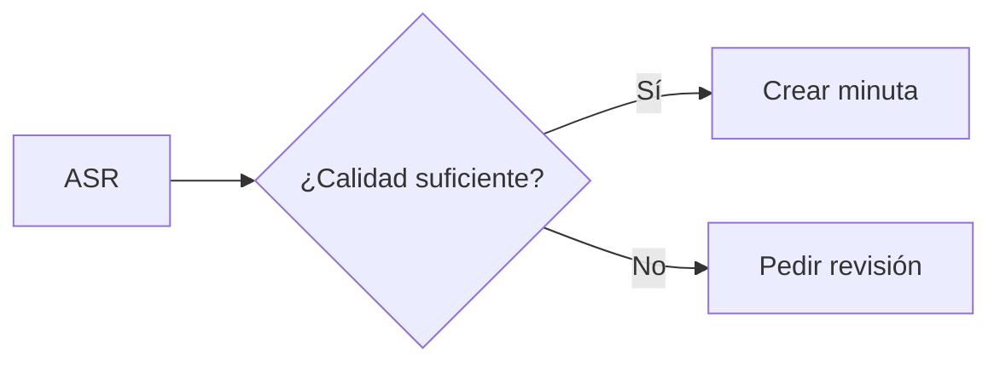

# L2 · Caso 09 — Pipeline de minuta de reunión
## Teoría ampliada del archivo

### ASR no es minuta

ASR intenta conservar lo dicho. Una minuta selecciona qué información es accionable. Son outputs diferentes y ambos deben guardarse.

<table>
<tr><th>Salida</th><th>Pregunta</th><th>Riesgo</th></tr>
<tr><td>Transcripción</td><td>¿Qué se escuchó?</td><td>Puede tener errores ASR.</td></tr>
<tr><td>Resumen</td><td>¿De qué se trató?</td><td>Puede omitir contexto.</td></tr>
<tr><td>Decisiones</td><td>¿Qué se acordó?</td><td>No se deben inventar acuerdos.</td></tr>
<tr><td>Tareas</td><td>¿Qué sigue?</td><td>No inventar responsables o fechas.</td></tr>
</table>

### Evaluación recomendada

Crear golden cases con reuniones cortas y decisiones conocidas. Medir por separado precisión de transcripción, recall de tareas y presencia de alucinaciones.

Leé la teoría general: [Teoría completa L2](TEORIA_L2_AUDIO_PIPELINES.md).


## Qué aprendés

Este ejemplo muestra que una transcripción no es el final del pipeline. Una reunión se vuelve útil cuando termina con información accionable y validada.

El recorrido usa un audio real de la clase y separa dos responsabilidades:

1. Whisper convierte audio en texto.
2. LangChain convierte texto en resumen, decisiones y tareas.

## Flujo del ejemplo



## Por qué no resumir directamente el audio

El ASR y el resumen resuelven problemas distintos.

<table>
<tr><th>Etapa</th><th>Pregunta</th><th>Salida</th></tr>
<tr><td>ASR</td><td>¿Qué se dijo?</td><td>Transcripción literal.</td></tr>
<tr><td>Resumen</td><td>¿Cuál es la idea central?</td><td>Texto breve.</td></tr>
<tr><td>Extracción</td><td>¿Qué decisiones y tareas aparecen?</td><td>Listas estructuradas.</td></tr>
<tr><td>Revisión</td><td>¿Falta contexto?</td><td>Bandera de revisión.</td></tr>
</table>

## El contrato Pydantic

MinutaReunion exige:

```text
resumen
decisiones
tareas
requiere_revision
motivo_revision
```

Las listas deben tener al menos un elemento. Esto evita que el modelo responda con una minuta vacía que parezca válida.

## Cómo ejecutar

```powershell
.\.venv\Scripts\python.exe .\03_extras\L2_audio_y_pipelines\resumen\09_pipeline_minuta_reunion.py
```

El script realiza una llamada real a Whisper y otra al modelo de texto.

## Lectura de la salida

Primero aparece transcripción: evidencia cruda de lo que entendió ASR.

Después aparece minuta: interpretación estructurada para una persona o un sistema posterior.

> Una tarea solo debe aparecer si está respaldada por la transcripción. Si no hay responsable o fecha, no se inventa.

## Experimento guiado

1. Ejecutá el caso con reunion equipo normal.
2. Reemplazá el audio por la variante rápida.
3. Compará qué pasa con decisiones y tareas.
4. Cambiá el prompt para pedir riesgos pendientes.
5. Agregá un campo opcional responsables y discutí cuándo debe ser null.

## Preguntas para discutir

- ¿Una buena transcripción garantiza una buena minuta?
- ¿Qué sucede si dos personas hablan al mismo tiempo?
- ¿Cuándo requiere revisión humana una reunión?
- ¿Qué campos no deberían inventarse nunca?

## Extensión

Agregar una evaluación de calidad antes de resumir:


## Código y lectura ampliada

~~~python
with ruta_audio.open("rb") as archivo:
    transcripcion = cliente_audio.audio.transcriptions.create(
        model="whisper-1", file=archivo, language="es"
    ).text

minuta = extractor.with_structured_output(MinutaReunion).invoke(transcripcion)
~~~

La transcripción es evidencia literal. La minuta es una interpretación. El prompt no debe permitir inventar responsables, fechas o decisiones.

### Segundo gráfico: lógica del archivo

~~~mermaid
flowchart LR
    A["Audio de reunión"] --> B["Transcripción"] --> C["Resumen, tareas y decisiones"] --> D["Minuta"]
~~~

### Tabla de lectura rápida

| Salida | Pregunta de control |
|---|---|
| Resumen | ¿Es fiel al texto? |
| Decisión | ¿Fue dicha explícitamente? |
| Tarea | ¿Existe en evidencia? |
| Revisión | ¿Falta contexto? |

### Fórmula o regla relevante

~~~text
WER = (S + D + I) / N
La decisión final debe combinar métrica, contexto y política de riesgo.
~~~

