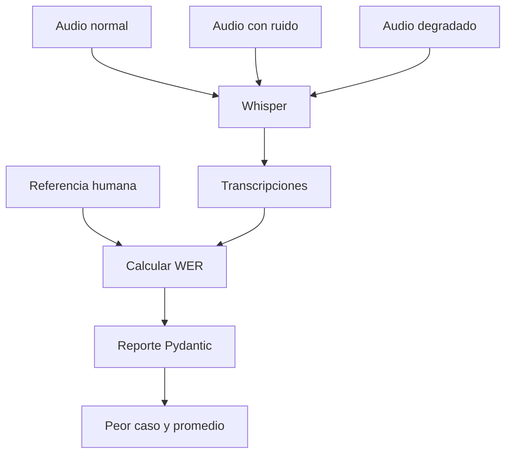

# L2 · Caso 10 — Benchmark de variantes con Whisper
## Teoría ampliada del archivo

### Diseño experimental

El benchmark cambia la condición del audio y mantiene contenido, referencia y modelo. Así el WER es comparable.

```text
WER promedio = suma de WER de todos los casos / cantidad de casos
```

<table>
<tr><th>Resultado</th><th>Interpretación</th></tr>
<tr><td>Audio limpio mejor que ruidoso</td><td>La degradación afecta ASR.</td></tr>
<tr><td>Peor caso estable</td><td>Hay una condición prioritaria para mejorar.</td></tr>
<tr><td>Promedio bueno y peor caso malo</td><td>El promedio oculta riesgo.</td></tr>
</table>

### Qué mejorar después

Antes de cambiar modelo, revisar volumen, ruido, cortes, formato, prompt de transcripción y términos del dominio. Cada cambio debe volver a medirse sobre el mismo set.

Leé la teoría general: [Teoría completa L2](TEORIA_L2_AUDIO_PIPELINES.md).


## Qué aprendés

Una demo con un audio limpio no demuestra que un sistema sea robusto. Este caso evalúa la misma llamada de soporte en tres condiciones:

- Audio original.
- Audio con ruido.
- Audio degradado: ruido, menor volumen y cortes.

Todos se comparan contra la misma transcripción humana de referencia.

## Flujo del benchmark



## Por qué usar la misma referencia

Cada variante representa el mismo contenido hablado. La única diferencia debe ser la condición acústica. Así el WER permite atribuir los cambios a la degradación del audio y no al contenido.

<table>
<tr><th>Variable</th><th>Se mantiene o cambia</th><th>Motivo</th></tr>
<tr><td>Contenido</td><td>Se mantiene</td><td>Permite una comparación justa.</td></tr>
<tr><td>Referencia</td><td>Se mantiene</td><td>Es el ground truth común.</td></tr>
<tr><td>Ruido y cortes</td><td>Cambian</td><td>Simulan condiciones reales.</td></tr>
<tr><td>Modelo ASR</td><td>Se mantiene</td><td>Se mide el mismo sistema.</td></tr>
</table>

## Métricas que devuelve

<table>
<tr><th>Campo</th><th>Significado</th></tr>
<tr><td>casos</td><td>Resultado de cada WAV.</td></tr>
<tr><td>wer</td><td>Error de palabras de cada caso.</td></tr>
<tr><td>wer promedio</td><td>Comportamiento general del conjunto.</td></tr>
<tr><td>peor archivo</td><td>Caso que necesita diagnóstico primero.</td></tr>
</table>

## Cómo ejecutar

```powershell
.\.venv\Scripts\python.exe .\03_extras\L2_audio_y_pipelines\resumen\10_benchmark_variantes_whisper.py
```

Este archivo realiza tres transcripciones reales. Ejecutalo una vez y usá la salida para debatir en clase.

## Cómo leer el resultado

- WER igual a cero: coincidencia total con la referencia.
- WER bajo: pocos errores, pero revisar si afectan términos sensibles.
- WER alto: no automatizar sin comprender por qué falló.
- Peor archivo: punto de partida para mejorar audio, prompt o modelo.

## Experimento guiado

1. Anticipá cuál variante tendrá mayor WER.
2. Ejecutá el benchmark.
3. Agregá la variante rápida a la lista.
4. Compará promedio y peor caso.
5. Escribí una hipótesis técnica para cada error encontrado.

## Preguntas para discutir

- ¿Qué diferencia hay entre evaluación y demo?
- ¿Un WER promedio bueno puede esconder un caso terrible?
- ¿Qué variante incorporarías para representar el mundo real?
- ¿Qué harías antes de cambiar el modelo ASR?

## Extensión

Crear una tabla de resultados para cada versión del pipeline:

```text
modelo | prompt | audio | WER | términos críticos | revisión requerida
```

Esto convierte cambios de código en decisiones medibles.
## Código y lectura ampliada

~~~python
for nombre_archivo in archivos:
    transcripcion = transcribir(nombre_archivo)
    error = wer(referencia.lower(), transcripcion.lower())
    casos_medidos.append(CasoBenchmark(archivo=nombre_archivo, wer=error))

promedio = sum(caso.wer for caso in casos_medidos) / len(casos_medidos)
~~~

El benchmark cambia las condiciones acústicas y mantiene referencia y modelo. Así compara robustez, no contenido diferente.

### Segundo gráfico: lógica del archivo

~~~mermaid
flowchart LR
    A["Limpio, ruido y mal estado"] --> B["Mismo ASR"] --> C["WER por caso"] --> D["Promedio y peor caso"]
~~~

### Tabla de lectura rápida

| Métrica | Fórmula | Uso |
|---|---|---|
| Promedio | suma WER / casos | Calidad general. |
| Máximo | mayor WER | Peor escenario. |
| Dispersión | diferencia entre casos | Inestabilidad. |

### Fórmula o regla relevante

~~~text
WER = (S + D + I) / N
La decisión final debe combinar métrica, contexto y política de riesgo.
~~~

