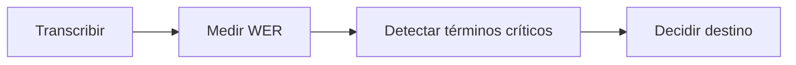

# L2 · Caso 11 — LangGraph auditable para una llamada
## Teoría ampliada del archivo

### Un pipeline auditable

El grafo guarda evidencia en cada etapa y separa responsabilidades.

```text
audio -> transcripción -> WER -> decisión -> destino operativo
```

<table>
<tr><th>Nodo</th><th>Entrada</th><th>Salida</th></tr>
<tr><td>Transcribir</td><td>Archivo WAV.</td><td>Texto ASR.</td></tr>
<tr><td>Medir</td><td>Texto y referencia.</td><td>WER.</td></tr>
<tr><td>Decidir</td><td>WER y texto.</td><td>Destino y motivo.</td></tr>
</table>

### Escalabilidad

Después se pueden agregar nodos de detección de términos críticos, logging, reintentos y observabilidad. La regla es conservar cada etapa simple y comprobable.

### Política de decisión

WER mayor a 0.15 es una regla didáctica. En producción debe surgir de golden cases, costos de revisión y riesgos del dominio.

Leé la teoría general: [Teoría completa L2](TEORIA_L2_AUDIO_PIPELINES.md).


## Qué aprendés

Este caso muestra una arquitectura visible. En lugar de ejecutar todo en un bloque, el pipeline conserva estado entre pasos:

1. Transcribe la llamada.
2. Calcula WER.
3. Decide qué destino operativo corresponde.

La ventaja no es “hacer más código”. La ventaja es poder inspeccionar dónde apareció un error.

## Arquitectura


## Estado del grafo

<table>
<tr><th>Campo</th><th>Quién lo agrega</th><th>Por qué importa</th></tr>
<tr><td>archivo</td><td>Entrada</td><td>Indica qué WAV se analiza.</td></tr>
<tr><td>referencia</td><td>Entrada</td><td>Permite calcular WER.</td></tr>
<tr><td>transcripción</td><td>Nodo ASR</td><td>Es evidencia antes de interpretar.</td></tr>
<tr><td>WER</td><td>Nodo de calidad</td><td>Es señal objetiva de error.</td></tr>
<tr><td>decisión</td><td>Nodo LangChain</td><td>Explica el siguiente paso.</td></tr>
</table>

## Qué decide el último nodo

El agente recibe la transcripción y el WER. Su tarea es elegir un destino:

- Procesar soporte.
- Pedir revisión humana.
- Pedir un nuevo audio.

La regla del ejemplo propone escalar cuando WER es mayor a 0.15. Ese número es una hipótesis didáctica, no una regla universal. En producción el umbral depende del riesgo, los costos y la evidencia obtenida con golden cases.

## Cómo ejecutar

```powershell
.\.venv\Scripts\python.exe .\03_extras\L2_audio_y_pipelines\resumen\11_flujo_calidad_langgraph.py
```

## Experimento guiado

1. Ejecutá el flujo con la llamada ruidosa.
2. Cambiá el archivo por la llamada limpia.
3. Compará WER, motivo y destino.
4. Subí el umbral a 0.25.
5. Discutí qué tipo de error pasa a automatizarse por esa decisión.

## LangChain y LangGraph

<table>
<tr><th>Herramienta</th><th>Mejor para</th><th>En este caso</th></tr>
<tr><td>LangChain</td><td>Una llamada a un modelo y salida estructurada.</td><td>Redacta la decisión final.</td></tr>
<tr><td>LangGraph</td><td>Varios pasos con estado visible.</td><td>Conecta ASR, WER y decisión.</td></tr>
</table>

## Preguntas para discutir

- ¿Por qué la transcripción debe quedar en el estado?
- ¿Qué nodo se puede reintentar sin repetir todo?
- ¿Dónde agregarías una detección de términos críticos?
- ¿Qué información guardarías en un log de auditoría?

## Extensión

Agregar un nodo antes de decidir destino:



Así el pipeline combina métrica general, riesgo semántico y decisión operativa.
## Código y lectura ampliada

~~~python
grafo.add_node("transcribir_llamada", transcribir_llamada)
grafo.add_node("medir_calidad", medir_calidad)
grafo.add_node("decidir_destino", decidir_destino)
grafo.add_edge(START, "transcribir_llamada")
grafo.add_edge("transcribir_llamada", "medir_calidad")
grafo.add_edge("medir_calidad", "decidir_destino")
~~~

Cada nodo tiene una responsabilidad: evidenciar, medir o decidir. Esto permite reintentar y auditar sin ocultar pasos.

### Segundo gráfico: lógica del archivo

~~~mermaid
flowchart LR
    A["WAV"] --> B["Transcripción"] --> C["WER"] --> D["Destino"]
~~~

### Tabla de lectura rápida

| Nodo | Entrada | Salida |
|---|---|---|
| Transcribir | WAV | Texto ASR. |
| Medir | Texto y referencia | WER. |
| Decidir | WER y texto | Destino y motivo. |

### Fórmula o regla relevante

~~~text
WER = (S + D + I) / N
La decisión final debe combinar métrica, contexto y política de riesgo.
~~~

