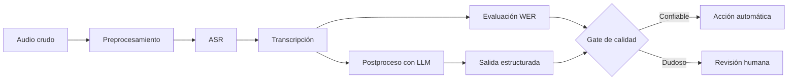

# Teoría completa — L2: Audio pipelines y evaluación

## 1. Objetivo de L2

Un audio pipeline no termina cuando aparece una transcripción. Un sistema confiable debe transformar voz en texto, medir la calidad de ese texto, interpretar su significado y decidir si puede automatizarse.



## 2. Las etapas de un pipeline

<table>
<tr><th>Etapa</th><th>Pregunta técnica</th><th>Riesgo si falla</th></tr>
<tr><td>Audio</td><td>¿La señal es audible y completa?</td><td>La voz no contiene evidencia suficiente.</td></tr>
<tr><td>Preprocesamiento</td><td>¿Hay ruido, bajo volumen o sample rate inadecuado?</td><td>ASR recibe una señal degradada.</td></tr>
<tr><td>ASR</td><td>¿Qué palabras se pronunciaron?</td><td>Errores de sustitución, omisión o inserción.</td></tr>
<tr><td>Tokenización</td><td>¿Cómo representa el modelo las palabras?</td><td>Jerga, nombres y montos pueden fragmentarse.</td></tr>
<tr><td>LLM</td><td>¿Qué significa el texto?</td><td>Un resumen interpreta texto erróneo.</td></tr>
<tr><td>Validación</td><td>¿La salida respeta el contrato?</td><td>Un backend recibe datos ambiguos.</td></tr>
<tr><td>Evaluación</td><td>¿Qué tan bien funciona en casos conocidos?</td><td>Se despliega sin evidencia.</td></tr>
</table>

## 3. ASR

ASR significa Automatic Speech Recognition. Convierte señal de voz en texto. En los ejercicios se usa Whisper para que el alumno vea una transcripción real de un archivo WAV.

Un modelo ASR no entiende el negocio por sí solo. Reconoce patrones acústicos y produce una hipótesis de texto. Luego otro componente puede resumir, clasificar o extraer acciones.

## 4. Preprocesamiento y calidad de audio

Antes de ASR, la señal puede necesitar:

- Resampling: convertir a un sample rate compatible.
- Normalización: evitar volumen demasiado bajo o saturado.
- Reducción de ruido: reducir interferencias.
- Segmentación: separar clips muy largos.
- Detección de silencio: evitar procesar ausencia de voz.

No siempre conviene “limpiar” agresivamente. Un filtro mal aplicado puede deformar sonidos importantes y empeorar la transcripción.

## 5. Tokenización

Después de obtener texto, los modelos lo representan mediante tokens.

<table>
<tr><th>Esquema</th><th>Ejemplo</th><th>Ventaja</th><th>Limitación</th></tr>
<tr><td>Palabra</td><td>transferir | 99.50 | cuenta</td><td>Pocos pasos.</td><td>Falla en palabras nuevas.</td></tr>
<tr><td>Carácter</td><td>t | r | a | n | s | f | e | r | i | r</td><td>Puede formar cualquier palabra.</td><td>Muchos pasos y más errores de escritura.</td></tr>
<tr><td>Subword</td><td>trans | fer | ir</td><td>Equilibrio entre cobertura y eficiencia.</td><td>Puede fragmentar términos para humanos.</td></tr>
</table>

BPE fusiona pares frecuentes de caracteres. WordPiece selecciona subpalabras estadísticamente útiles. Ambos permiten manejar nombres, jerga y términos desconocidos mejor que un vocabulario fijo de palabras.

## 6. WER

WER compara una transcripción con una referencia humana.

```text
WER = (S + D + I) / N
```

<table>
<tr><th>Símbolo</th><th>Significado</th><th>Ejemplo</th></tr>
<tr><td>S</td><td>Sustitución</td><td>ocho cambia por dos.</td></tr>
<tr><td>D</td><td>Deleción</td><td>Se omite “horas”.</td></tr>
<tr><td>I</td><td>Inserción</td><td>Se agrega una palabra que nadie dijo.</td></tr>
<tr><td>N</td><td>Palabras de referencia</td><td>Base para normalizar el error.</td></tr>
</table>

WER sirve para comparar modelos, prompts de ASR y condiciones acústicas. No mide directamente si un error es grave para el dominio.

## 7. Errores críticos

Un cambio en una palabra puede tener un impacto mucho mayor que su peso en WER.

<table>
<tr><th>Dominio</th><th>Términos críticos</th><th>Ejemplo de riesgo</th></tr>
<tr><td>Salud</td><td>Dosis, frecuencia, duración.</td><td>Ocho horas cambia por dos horas.</td></tr>
<tr><td>Finanzas</td><td>Monto, moneda, cuenta.</td><td>Mil cambia por diez mil.</td></tr>
<tr><td>Legal</td><td>Fecha, vigencia, negación.</td><td>Vence cambia por no vence.</td></tr>
<tr><td>Soporte</td><td>Ticket, producto, prioridad.</td><td>Cancelar cambia por cambiar.</td></tr>
</table>

Por eso L2 combina métrica global, detección de términos sensibles y revisión humana.

## 8. LLM después de ASR

El LLM trabaja sobre la transcripción. Puede:

- Resumir una reunión.
- Extraer tareas y decisiones.
- Clasificar una llamada.
- Detectar una intención.
- Producir un objeto Pydantic.

Regla central:

> Cambiar el LLM no arregla una transcripción rota. Primero se debe revisar la evidencia de ASR.

## 9. Pydantic y salidas estructuradas

Pydantic impone un contrato. Si un pipeline necesita tareas, prioridad y revisión humana, esos campos deben existir con tipos claros.

```python
class ReporteAudio(BaseModel):
    transcripcion: str
    resumen: str
    requiere_revision: bool
    confianza: float
```

Las descriptions de los campos también orientan al modelo cuando se usa structured output.

## 10. Golden cases y benchmark

Un golden set reúne audios fijos con transcripción humana esperada. Debe contener variedad:

- Audio limpio.
- Ruido.
- Habla rápida.
- Pausas.
- Cortes.
- Acentos.
- Nombres y jerga.
- Casos de riesgo alto.

Para cada versión del pipeline conviene guardar:

```text
modelo ASR | modelo LLM | audio | WER | término crítico | decisión | fecha
```

## 11. Transformers y difusión

<table>
<tr><th>Arquitectura</th><th>Fortaleza</th><th>Usos típicos</th></tr>
<tr><td>Transformer</td><td>Comprende contexto de secuencias.</td><td>ASR, clasificación, resumen y traducción.</td></tr>
<tr><td>Diffusion</td><td>Refina señal de ruido a audio detallado.</td><td>Generación, restauración, voz y música.</td></tr>
</table>

En L2 los Transformers aparecen en ASR y en el LLM posterior. Los modelos de difusión se estudian como alternativa para generación o restauración de audio, no como sustituto directo de transcripción.

## 12. Criterio profesional

Un pipeline de audio responsable conserva la evidencia, mide sus errores, documenta la decisión y sabe detener la automatización cuando el riesgo supera la confianza.

## 13. Ejemplos mínimos de código

### Calcular WER

~~~python
from jiwer import wer

referencia = "quiero cambiar mi pedido"
hipotesis = "quiero cancelar mi pedido"
print(wer(referencia, hipotesis))
~~~

### Transcribir un WAV

~~~python
from openai import OpenAI

cliente = OpenAI()
with open("llamada.wav", "rb") as archivo:
    respuesta = cliente.audio.transcriptions.create(
        model="whisper-1",
        file=archivo,
        language="es",
    )

print(respuesta.text)
~~~

### Pedir salida validada

~~~python
class ResumenAudio(BaseModel):
    resumen: str
    requiere_revision: bool

resultado = ChatOpenAI(model="gpt-4o-mini").with_structured_output(
    ResumenAudio
).invoke("Transcripción: quiero cambiar mi pedido")
~~~

## 14. Tabla de diagnóstico rápido

<table>
<tr><th>Problema visible</th><th>Hipótesis</th><th>Primer control</th></tr>
<tr><td>Transcripción vacía</td><td>Archivo o formato inválido.</td><td>Comprobar WAV y duración.</td></tr>
<tr><td>Muchos errores</td><td>Ruido, voz rápida o bajo volumen.</td><td>Calcular WER y comparar variantes.</td></tr>
<tr><td>Resumen incorrecto</td><td>ASR erróneo o prompt ambiguo.</td><td>Leer la transcripción antes del resumen.</td></tr>
<tr><td>Decisión peligrosa</td><td>Umbral o términos críticos mal definidos.</td><td>Revisar golden cases y política.</td></tr>
</table>

## 15. Fórmulas útiles

~~~text
WER = (sustituciones + deleciones + inserciones) / palabras de referencia
WER promedio = suma de WER de los casos / cantidad de casos
tasa de revisión = casos enviados a revisión / casos totales
~~~

