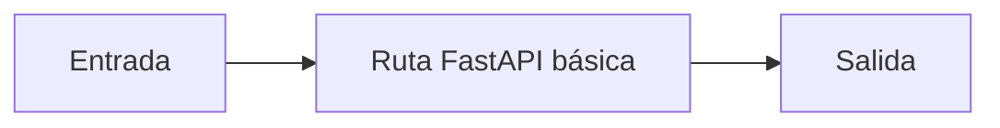

# Ruta FastAPI básica

## Objetivo

Define un endpoint HTTP mínimo.

```mermaid
flowchart LR
    A[Entrada] --> B[Ruta FastAPI básica]
    B --> C[Salida]
```

## Explicación

Una ruta convierte método y URL en una función de Python.

## Práctica

Probá el endpoint desde /docs.
