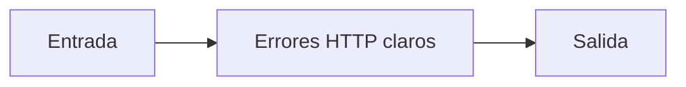

# Errores HTTP claros

## Objetivo

Devuelve fallas comprensibles desde una API.

## Explicación

Un error tipado evita que un cliente reciba un traceback o éxito falso.

## Práctica

Probá una consulta inexistente.
