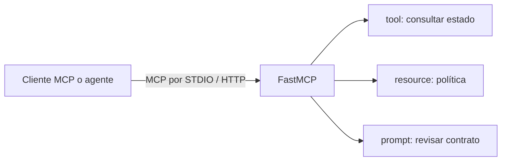

# FastMCP: servidor de contratos real

## Objetivo

Publicar un servidor MCP real llamado **LegalMove Contratos**. No es un objeto
simulado: cualquier cliente compatible puede descubrir su tool, leer su resource
y solicitar su prompt mediante el protocolo MCP.



## Qué enseña el código

| Elemento | Decorador | Para qué sirve |
|---|---|---|
| Tool | `@mcp.tool` | Ejecutar una acción con argumentos. |
| Resource | `@mcp.resource` | Leer conocimiento identificado por una URI. |
| Prompt | `@mcp.prompt` | Reutilizar una instrucción para un host o agente. |

El diccionario `contratos` es un origen de datos didáctico. La conexión MCP sí
es real; para producción se reemplaza ese diccionario por una base de datos o
una API, sin cambiar el contrato publicado.

## Publicación

Desde esta carpeta y con el entorno virtual activo:

```powershell
fastmcp run .\00_fundamentos\00_servidor_contratos.py:mcp
```

Para publicarlo en la web, usá Streamable HTTP. Es el transporte que debe
consumir un cliente remoto; STDIO solo aplica a un proceso local:

```powershell
fastmcp run .\00_fundamentos\00_servidor_contratos.py:mcp --transport streamable-http --port 8001
```

El cliente integrador puede apuntar a esa publicación con:

```env
FASTMCP_CONTRATOS_URL=http://127.0.0.1:8001/mcp/
```

## Práctica

Agregá un contrato `C-400`, volvé a ejecutar el cliente y observá que el
agente puede consultar el nuevo dato sin cambiar su código.
