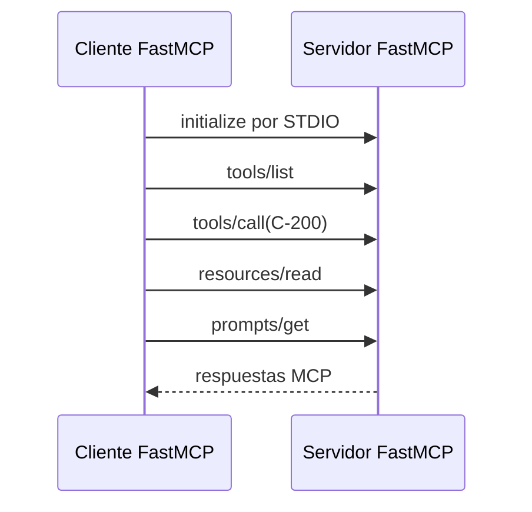

# FastMCP: cliente real por STDIO

## Objetivo

Ejecutar un cliente que abre una sesión MCP real contra el archivo del servidor.
El cliente no llama a `consultar_estado_contrato()` como una función Python:
descubre la capacidad y la invoca mediante `Client`.

## Lectura del resultado

| Salida | Prueba que realiza |
|---|---|
| `Tools descubiertas` | El contrato de la tool fue publicado y descubierto. |
| `Contrato consultado` | El cliente invocó una tool con argumentos. |
| `Política leída` | El cliente resolvió una URI de resource. |
| `Prompt solicitado` | El cliente recuperó una plantilla del servidor. |

Ejecutalo con `python 01_cliente_stdio_real.py`. FastMCP inicia la conexión
STDIO al archivo indicado; no requiere que abras una segunda terminal.

## Práctica

Cambiá el código a `C-300`. Luego publicá el servidor por HTTP y repetí el
mismo flujo usando `FASTMCP_CONTRATOS_URL` en el integrador del resumen.
