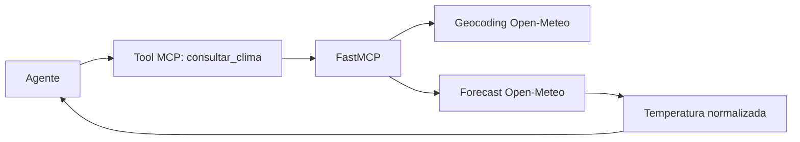

# FastMCP con una API pública: Open-Meteo

## Objetivo

Exponer el clima en tiempo real como una tool MCP. FastMCP no reemplaza a
Open-Meteo: define una interfaz tipada y estable para que un agente no necesite
conocer URLs, parámetros ni la respuesta completa del proveedor.



| Capa | Responsabilidad |
|---|---|
| Agente | Decide cuándo necesita clima. |
| FastMCP | Publica la tool y valida el argumento `ciudad`. |
| httpx | Realiza las llamadas HTTP. |
| Open-Meteo | Aporta datos meteorológicos vivos. |

## Publicación y prueba

```powershell
fastmcp run .\00_api_publica_openmeteo.py:mcp --transport streamable-http --port 8002
```

La URL remota será `http://127.0.0.1:8002/mcp/`. Para una web o un agente fuera
de la máquina, se publica el mismo endpoint detrás de HTTPS.

## Práctica

Pedí `Buenos Aires`, `Madrid` y una ciudad inexistente. Compará el caso exitoso
con la respuesta controlada de ciudad no encontrada.
