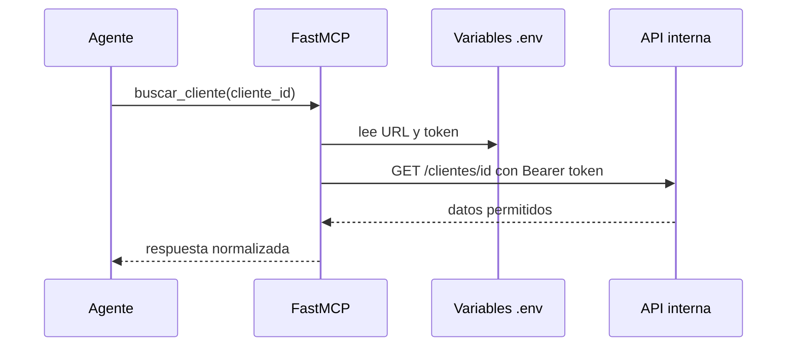

# FastMCP con una API propia

## Objetivo

Conectar un MCP con el backend de la organización sin exponer el token al
agente. El modelo solo ve el nombre, la descripción y el schema de la tool;
las credenciales permanecen en el entorno del servidor.



## Configuración

```env
API_PROPIA_BASE_URL=https://api.tu-organizacion.com
API_PROPIA_TOKEN=token-de-servicio
```

No se debe pasar el token como argumento de la tool, colocarlo en el prompt ni
imprimirlo. El ejemplo devuelve un mensaje claro mientras se conserva la
configuración de ejemplo.

## Publicación

```powershell
fastmcp run .\01_api_propia_clientes.py:mcp --transport streamable-http --port 8003
```

## Práctica

Creá primero una API de prueba con un único endpoint `GET /clientes/{id}`.
Después reemplazá la URL y observá que el agente no necesita cambiar para usar
el proveedor interno real.
