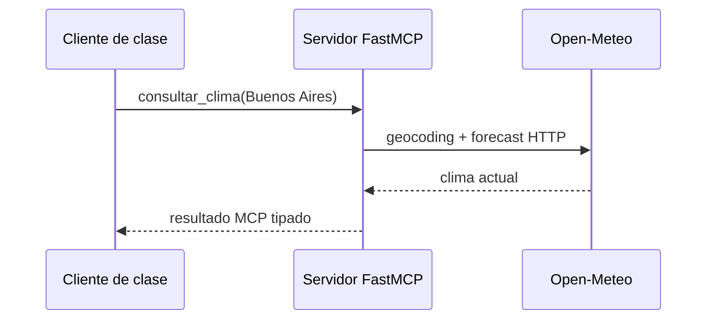

# Cliente real: FastMCP + API externa

## Objetivo

Verificar una integración completa y observable: el cliente inicia el servidor
FastMCP por STDIO, el servidor consulta Open-Meteo por HTTP y la tool devuelve
datos vivos al cliente.



Ejecutá desde la raíz:

```powershell
.\.venv\Scripts\python.exe .\03_extras\L3_mcp_y_agentes\fastmcp\02_en_marcha\00_cliente_clima_real.py
```

La salida debe incluir ciudad, temperatura y código de tiempo. Si no hay red,
la API externa no podrá responder: eso demuestra que no es una simulación.

## Práctica

Convertí el resultado de `resultado.data` en un modelo Pydantic y luego pasalo
a un agente LangChain que explique si conviene planificar una actividad al aire
libre.
