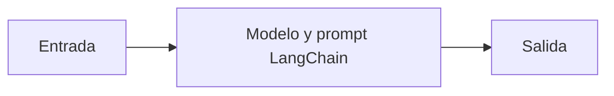

# Modelo y prompt LangChain

## Objetivo

Conecta un prompt parametrizado con un modelo.

## Explicación

El prompt formula tarea; el modelo produce texto; invoke entrega datos reales.

## Práctica

Cambiá una variable del prompt.
