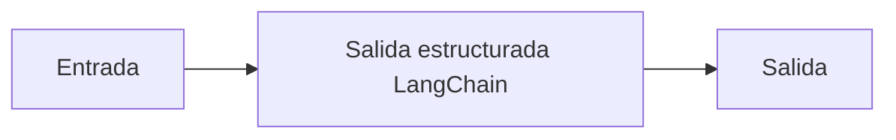

# Salida estructurada LangChain

## Objetivo

Pide al modelo una salida compatible con Pydantic.

## Explicación

Structured output estabiliza forma, no garantiza verdad factual.

## Práctica

Agregá un campo obligatorio al schema.
