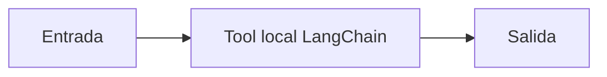

# Tool local LangChain

## Objetivo

Declara una función invocable por un agente.

## Explicación

La tool entrega un dato verificable con argumentos explícitos.

## Práctica

Consultá un código inexistente.
