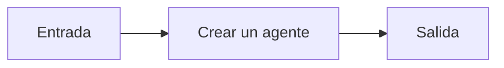

# Crear un agente

## Objetivo

Crea un agente que puede elegir usar herramientas.

## Explicación

El agente orquesta; la tool conserva la fuente de verdad.

## Práctica

Comprobá que consulta la tool antes de responder.
