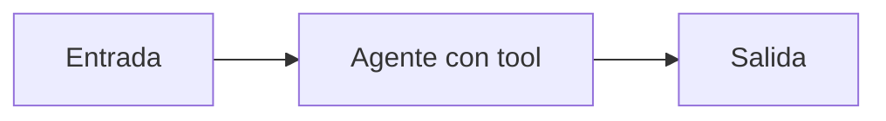

# Agente con tool

## Objetivo

Integra consulta verificable, agente y salida visible.

## Explicación

El dato debe venir de la tool; el LLM debe explicarlo sin inventarlo.

## Práctica

Cambiá el catálogo y verificá el resultado.
