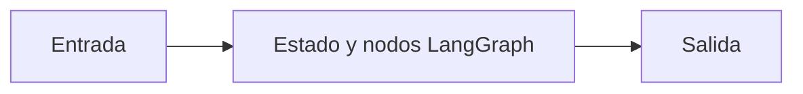

# Estado y nodos LangGraph

## Objetivo

Presenta estado tipado y actualizaciones de nodos.

## Explicación

Cada nodo lee estado y devuelve solo los campos que agrega.

## Práctica

Indicá qué campo produce cada nodo.
