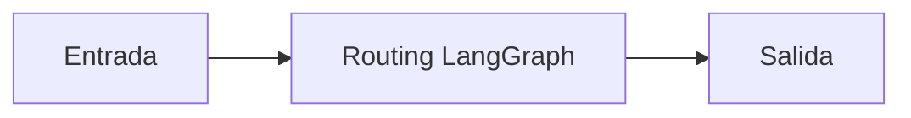

# Routing LangGraph

## Objetivo

Elige una ruta según una condición del estado.

```mermaid
flowchart LR
    A[Entrada] --> B[Routing LangGraph]
    B --> C[Salida]
```

## Explicación

La condición es política visible y comprobable.

## Práctica

Probá los dos lados del routing.
