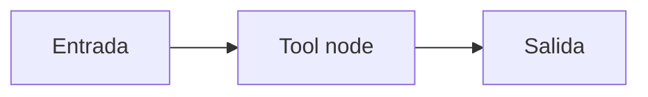

# Tool node

## Objetivo

Representa una tool como nodo explícito del flujo.

## Explicación

Separar tool y agente conserva el handoff auditable.

## Práctica

Mostrá el estado antes y después de la tool.
