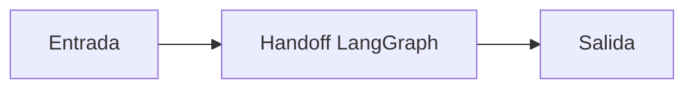

# Handoff LangGraph

## Objetivo

Coordina responsabilidades mediante estado compartido.

## Explicación

Un handoff correcto entrega evidencia, no solo una conclusión.

## Práctica

Identificá el contrato entre nodos.
