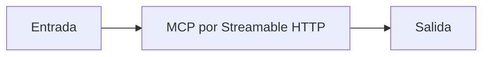

# MCP por Streamable HTTP

## Objetivo

Expone capacidades MCP a clientes remotos por HTTP.

## Explicación

HTTP permite separar cliente y servidor por red; requiere operación, seguridad y observabilidad.

## Práctica

Compará el despliegue de HTTP con STDIO.
