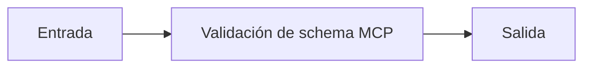

# Validación de schema MCP

## Objetivo

Valida los argumentos que recibe una capacidad antes de usarla.

## Explicación

Un schema reduce entradas incompletas o mal formadas; no autoriza automáticamente una acción.

## Práctica

Enviá un argumento faltante y explicá el error.
