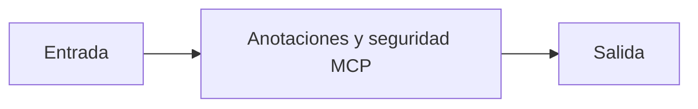

# Anotaciones y seguridad MCP

## Objetivo

Documenta metadatos y límites de una capacidad publicada.

## Explicación

Las anotaciones ayudan al host y al usuario a comprender impacto y autorización requerida.

## Práctica

Marcá qué tool tendría efectos externos.
